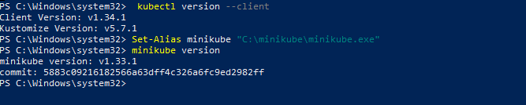
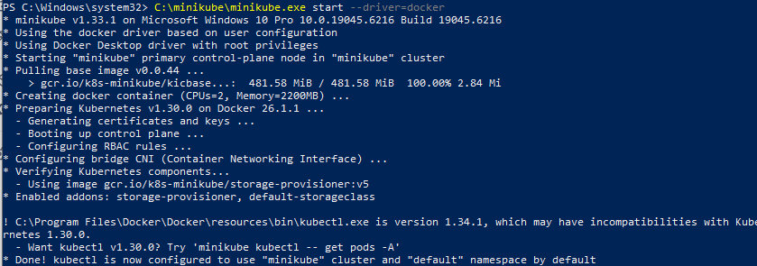
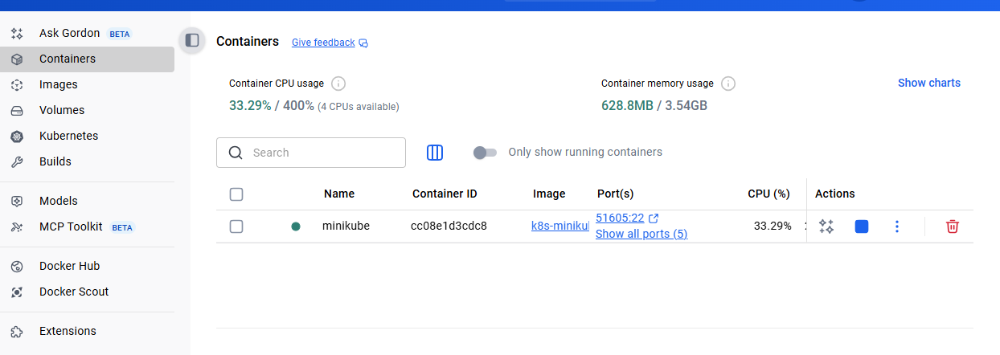
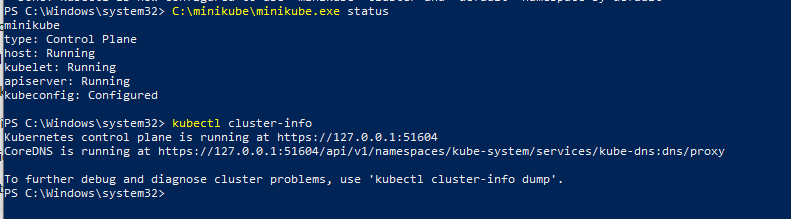
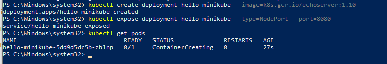
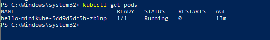
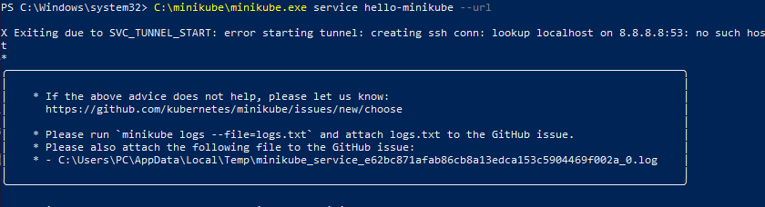
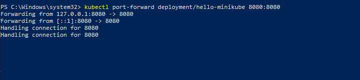
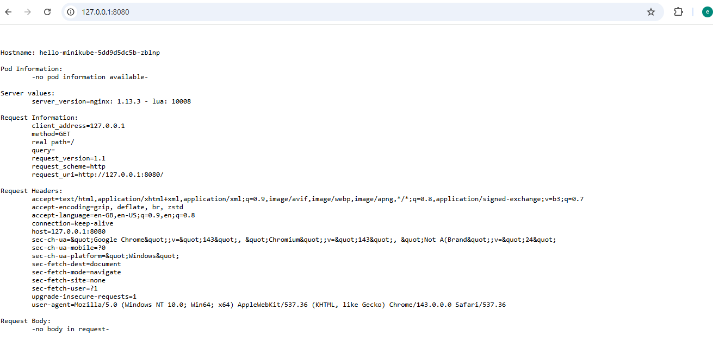
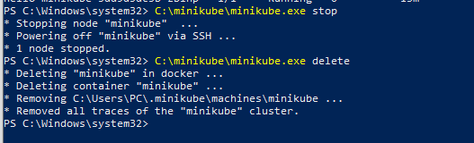

#  Install and Setup Minikube 

## Task Overview
In this project, I installed and set up Minikube on a Windows machine using the Docker driver. This allows me to run a local Kubernetes cluster for development and testing purposes without using a cloud provider.

---

## Steps I Followed

### 1. Prerequisites
- I installed Kubernetes and added it to environment variables
- I Confirmed that kubectl is installed:
```bash
kubectl version --client
```
### I addee Screnshoot



### 2. Install Minikube
- Downloaded Minikube executable and placed it in `C:\minikube`.
- Added `C:\minikube` to the System PATH.
- Verified Minikube installation:
```bash
C:\minikube\minikube.exe version
```

### I addee Screnshoot


### 3. Start Minikube using Docker driver
- Started Minikube with Docker:
```bash
C:\minikube\minikube.exe start --driver=docker
```
- Minikube successfully started with Kubernetes v1.30.0.

### I addee Screnshoot




### 4. Verify Minikube Cluster
- Checked cluster status:
```bash
C:\minikube\minikube.exe status
kubectl cluster-info
```
- Confirmed all components were running.

### I addee Screnshoot



### 5. Deploy a Simple Application
- Created a deployment:
```bash
kubectl create deployment hello-minikube --image=k8s.gcr.io/echoserver:1.10
```
- Exposed the deployment as a service:
```bash
kubectl expose deployment hello-minikube --type=NodePort --port=8080
```
- Checked pods status:
```bash
kubectl get pods
```

### I addee Screnshoot




### 6. Access the Application
- I attempted to get service URL:
```bash
 C:\minikube\minikube.exe service hello-minikube --url
``` 
But i encountered this error X Exiting due to SVC_TUNNEL_START: error starting tunnel: creating ssh conn: lookup localhost on 8.8.8.8:53: no such host
*

### I addee Screnshoot



- Solution: I Used port-forwarding to access the application locally:
```bash
kubectl port-forward deployment/hello-minikube 8080:8080
```
- Opened browser at `http://127.0.0.1:8080` and successfully accessed the hello-minikube echoserver.

### I addee Screnshoot




### 7. Clean Up
- Stopped and deleted Minikube when finished:
```bash
C:\minikube\minikube.exe stop
C:\minikube\minikube.exe delete
```

### I addee Screnshoot



---

## Conclusion
- Installed and configured Minikube on Windows using Docker driver.
- Deployed a simple Kubernetes application and exposed it as a NodePort service.
- Resolved service access issues using `kubectl port-forward`.
- Verified the application is running successfully on localhost.

---


