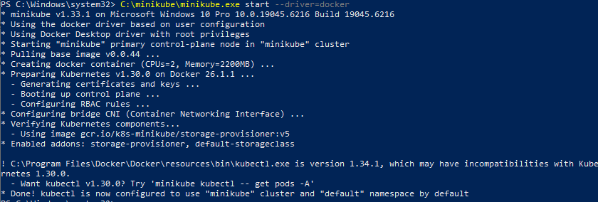
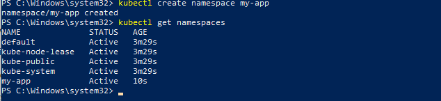
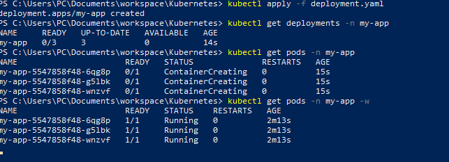
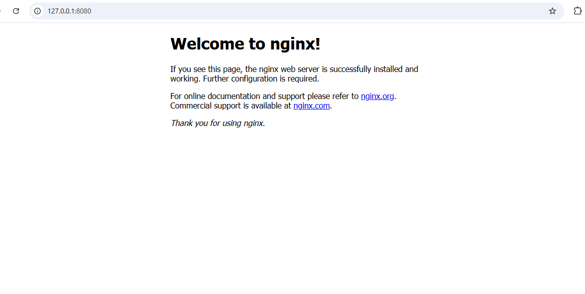
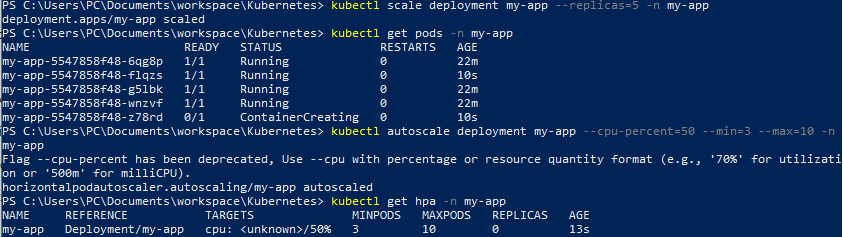
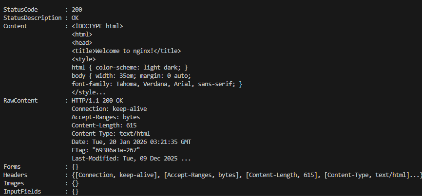

# Kubernetes Basics in DevOps Automation and Scaling

## Overview

As a junior DevOps engineer, I compared Kubernetes and Docker Swarm to understand why Kubernetes is widely adopted for orchestrating applications.

---

## 1. Scalability

- **Kubernetes**: Supports **thousands of nodes** and tens of thousands of pods, making it suitable for enterprise-level, large-scale deployments.
- **Docker Swarm**: Limited scalability; better suited for smaller clusters and simpler applications.

---

## 2. Automation

- **Kubernetes**:
  - **Self-healing**: Automatically restarts failed pods.
  - **Rolling updates**: Updates applications with zero downtime.
  - **Autoscaling**: Automatically scales pods based on CPU or memory usage.
- **Docker Swarm**:
  - Basic automation with service replication and load balancing.
  - Lacks advanced self-healing and autoscaling features.

---

## 3. Community and Ecosystem

- **Kubernetes**: Large, active community, rich ecosystem, and extensive documentation. Supported by major cloud providers and DevOps tools.
- **Docker Swarm**: Smaller community; development is slower and support is limited compared to Kubernetes.

---

## 4. DevOps Integration

- **Kubernetes**: Integrates seamlessly with **CI/CD pipelines**, Helm charts, Prometheus monitoring, and logging systems.
- **Docker Swarm**: Integrates with Docker Compose but has fewer DevOps-friendly tools and plugins.

---

## 5. Deployment Complexity

- **Kubernetes**: Steeper learning curve, more complex setup and management.
- **Docker Swarm**: Simpler and easier to set up, ideal for small teams and projects.

---

## Conclusion

- Kubernetes provides **robust scaling, automation, and load balancing features**, making it ideal for modern DevOps environments.
- Docker Swarm is simpler and easier to learn but lacks advanced features required for enterprise-level applications.
- **Therefore, Kubernetes is preferred for DevOps automation and scaling.**

---


## Task 2: Deploy a Basic Application on Kubernetes

### 1. Setting up the Minikube Cluster

```powershell
C:\minikube\minikube.exe start --driver=docker
```

- Verified the cluster is running:

```bash
C:\minikube\minikube.exe status
kubectl cluster-info
```

### I added Screenshots



**Explanation:**
- Creates a local Kubernetes cluster with a single control plane node.
- Docker driver is convenient on Windows.

---

### 2. Creating a Namespace

```bash
kubectl create namespace my-app
kubectl get namespaces
```

### I added Screenshots



**Explanation:**
- Namespaces provide logical separation of resources, useful for dev/staging/prod.

---

### 3. Creating the Deployment

`deployment.yaml`:

```yaml
apiVersion: apps/v1
kind: Deployment
metadata:
  name: my-app
  namespace: my-app
spec:
  replicas: 3
  selector:
    matchLabels:
      app: my-app
  template:
    metadata:
      labels:
        app: my-app
    spec:
      containers:
      - name: my-app
        image: nginx:latest
        ports:
        - containerPort: 80
```

```bash
kubectl apply -f deployment.yaml
kubectl get deployments -n my-app
kubectl get pods -n my-app -w
```

### I added Screenshots



**Explanation:**
- Deployment manages pods and ensures desired replicas run.
- Pods are the smallest deployable units, running containers.

---

### 4. Exposing the Deployment as a Service

`service.yaml`:

```yaml
apiVersion: v1
kind: Service
metadata:
  name: my-app-service
  namespace: my-app
spec:
  selector:
    app: my-app
  ports:
    - protocol: TCP
      port: 80
      targetPort: 80
  type: LoadBalancer
```

```powershell
kubectl apply -f service.yaml
kubectl get svc -n my-app
```

### I added Screenshots


**Note:** EXTERNAL-IP shows `<pending>` on Windows with Docker driver.

**Port-forward workaround:**
```bash
kubectl port-forward deployment/my-app 8080:80 -n my-app
```
- Access browser: `http://127.0.0.1:8080`
- Confirm nginx welcome page loads.


### I added Screenshots



**Explanation:**
- Services expose deployments; LoadBalancer type normally provides external IP.
- On Windows Minikube, port-forwarding simulates LoadBalancer access.

---

## Task 3: Scaling and Load Balancing

### 1. Manual Scaling

```bash
kubectl scale deployment my-app --replicas=5 -n my-app
kubectl get pods -n my-app
```

### I added Screenshots



**Explanation:**
- Manual scaling increases pod count for higher traffic.
- Kubernetes ensures desired replicas run.

---

### 2. Horizontal Pod Autoscaler (HPA)

```bash
kubectl autoscale deployment my-app --cpu-percent=50 --min=3 --max=10 -n my-app
kubectl get hpa -n my-app
```

**Explanation:**
- HPA automatically adjusts replicas based on CPU.
- Kubernetes manages resource allocation and load balancing.

---

### 3. Testing & Validation

**Port-forwarding** confirmed the app is reachable:
- Browser: `http://127.0.0.1:8080`

**Simulate traffic:**
```bash
for ($i=1; $i -le 100; $i++) { curl http://127.0.0.1:8080/ }
```
- Confirmed pods respond with HTTP 200 and nginx HTML.

### I added Screenshots



**Validation:**
- Application scaled manually and HPA is configured.
- Load balancing is automatically managed by Kubernetes service.

---

### 4. Reflection

- Kubernetes simplifies **deploying, scaling, and managing apps** in DevOps.
- HPA + Services provide **reliability and high availability**.
- Minikube allows simulating production behavior locally: scaling, traffic distribution, continuous availability.


