#  Deploying a Web Application on AWS EKS with NGINX Ingress

## Project Overview
I deployed a containerized web application on **AWS EKS**, exposed it through **NGINX Ingress**, and automated deployments with **GitHub Actions**. I also validated performance with **ApacheBench**.


---

## Create Project Folder
I started by creating the working folder:

```bash
mkdir eks-nginx-web-app
cd eks-nginx-web-app
```

This folder contains all Kubernetes manifests, the Dockerfile, Helm configuration, and CI/CD workflow.

### I added Screenshots
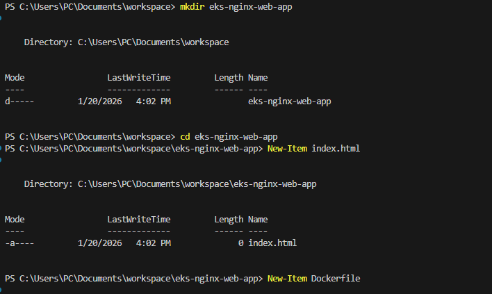

---

## Step 1: Prepare the Web Application Docker Image

**Dockerfile:**

```dockerfile
FROM nginx:latest
COPY . /usr/share/nginx/html
EXPOSE 80
```

Build and tag the Docker image:

```bash
docker build -t <bigoronaa>/web-app:latest .
```

### I added Screenshots
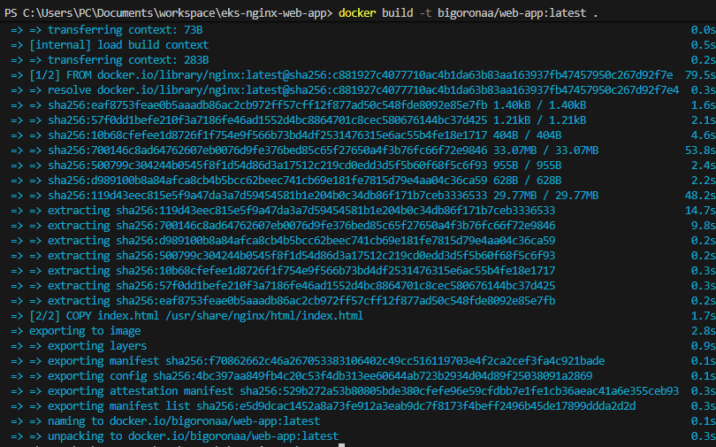
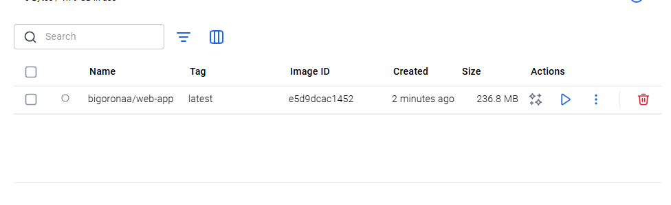
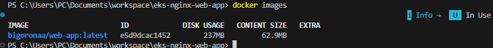

Login and push to Docker Hub:

```bash
docker login
docker push <bigoronaa>/web-app:latest
```

### I added Screenshots
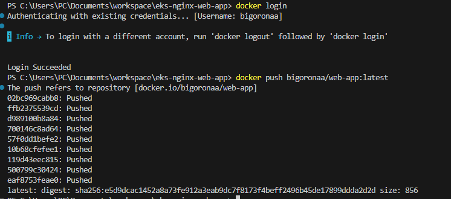
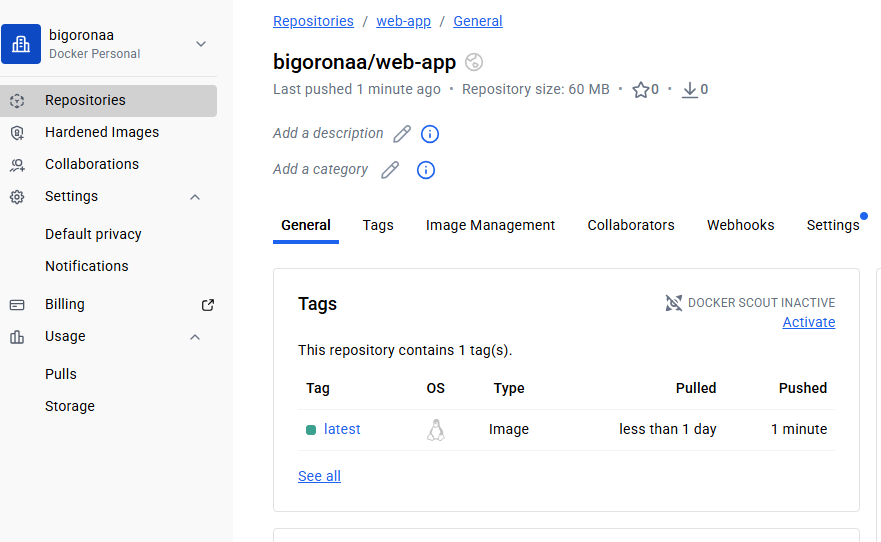

---

## Step 2: Set Up AWS EKS Cluster

I Created an AWS Cluster using the command
```bash
eksctl create cluster --name my-cluster --region us-west-2 --nodegroup-name my-nodes --node-type t3.medium --nodes 2
```

### I added Screenshots
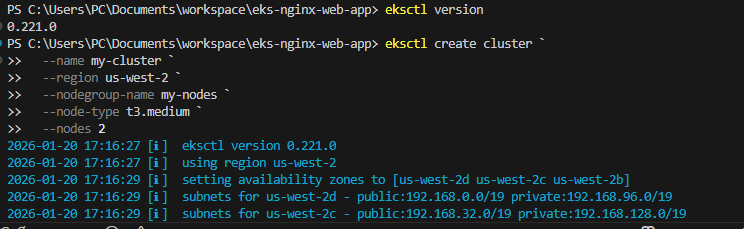


I Verified the nodes:
```bash
kubectl get nodes
```

### I added Screenshots
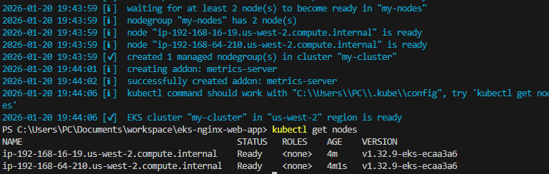


---

## Step 3: Install NGINX Ingress

I encountered a commandline error when i initially ran the command
```bash
helm repo add ingress-nginx https://kubernetes.github.io/ingress-nginx
helm repo update
```
### I added Screenshots
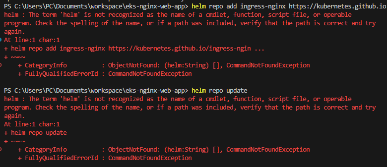

Fixed by downloading and installing Helm:
```powershell
Invoke-WebRequest -Uri https://get.helm.sh/helm-v3.12.3-windows-amd64.zip -OutFile helm.zip
Expand-Archive -LiteralPath helm.zip -DestinationPath .\helm
helm version
```

### I added Screenshots
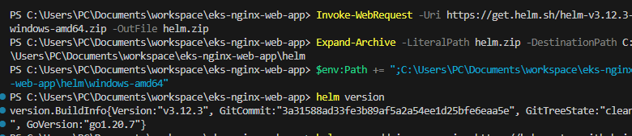

- I used helm to install ingress-nginx using the command
```bash
 helm install ingress-nginx ingress-nginx/ingress-nginx ` 
    --namespace ingress-nginx `
    --create-namespace `
    --set controller.resources.requests.cpu=100m `
    --set controller.resources.requests.memory=128Mi `
    --set controller.resources.limits.cpu=200m `
    --set controller.resources.limits.memory=256Mi
```

### I added Screenshots
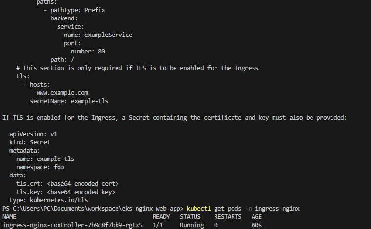

**Error Encountered:** INSTALLATION FAILED: failed pre-install: 1 error occurred: timed out waiting for the condition

I fixed this by reducing the resources to run Nginx

### I added Screenshots
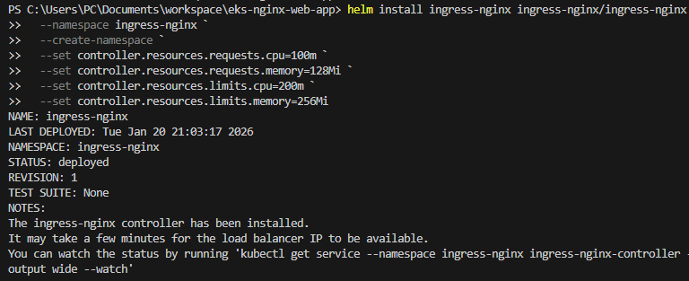

---

## Step 4: Deploy the Web Application

### Kubernetes Manifests
**deployment.yaml:**
```yaml
apiVersion: apps/v1
kind: Deployment
metadata:
  name: web-app
  namespace: default
spec:
  replicas: 3
  selector:
    matchLabels:
      app: web-app
  template:
    metadata:
      labels:
        app: web-app
    spec:
      containers:
      - name: web-app
        image: <my-dockerhub-username>/web-app:latest
        ports:
        - containerPort: 80
```

**service.yaml:**
```yaml
apiVersion: v1
kind: Service
metadata:
  name: web-app-service
  namespace: default
spec:
  selector:
    app: web-app
  ports:
  - protocol: TCP
    port: 80
    targetPort: 80
```

**ingress.yaml:**
```yaml
apiVersion: networking.k8s.io/v1
kind: Ingress
metadata:
  name: web-app-ingress
  namespace: default
  annotations:
    nginx.ingress.kubernetes.io/rewrite-target: /
spec:
  rules:
  - host: my-web-app.com
    http:
      paths:
      - path: /
        pathType: Prefix
        backend:
          service:
            name: web-app-service
            port:
              number: 80
```

**I applied the manifest:**
```powershell
kubectl apply -f deployment.yaml
kubectl apply -f service.yaml
kubectl apply -f ingress.yaml
```

### I added Screenshots
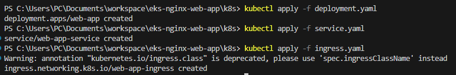


```powershell
kubectl get pods
kubectl get svc
kubectl get ingress
```

### I added Screenshots
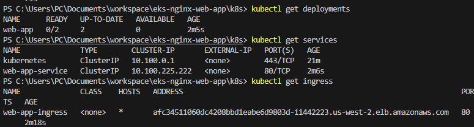


---

## Step 5: Set Up CI/CD Pipeline

- Created `.github/workflows/deploy.yml` to:
  - Build and push Docker image
  - Deploy to EKS
- Added GitHub Secrets:

### I added Screenshots
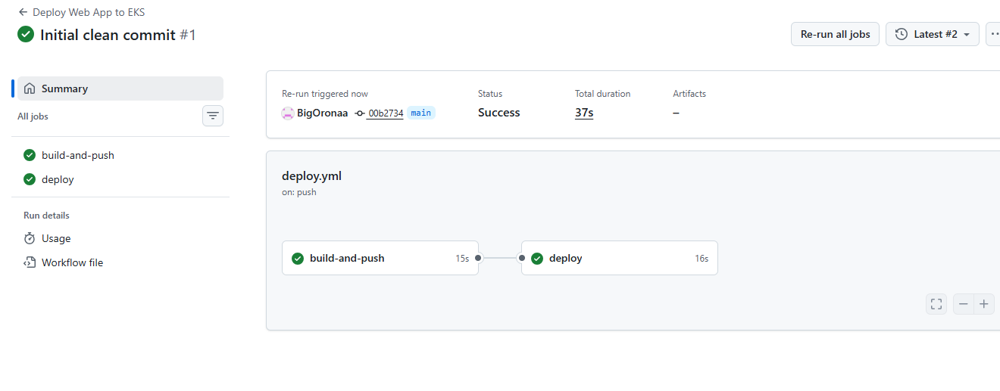


---

## Step 6: Test the Application

- Accessed via Ingress:
```bash
curl http://afc34511060dc4208bbd1eabe6d9803d-11442223.us-west-2.elb.amazonaws.com/
```

### I added Screenshots
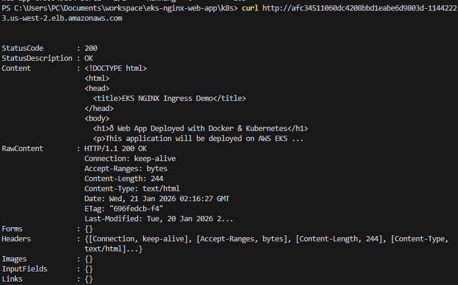
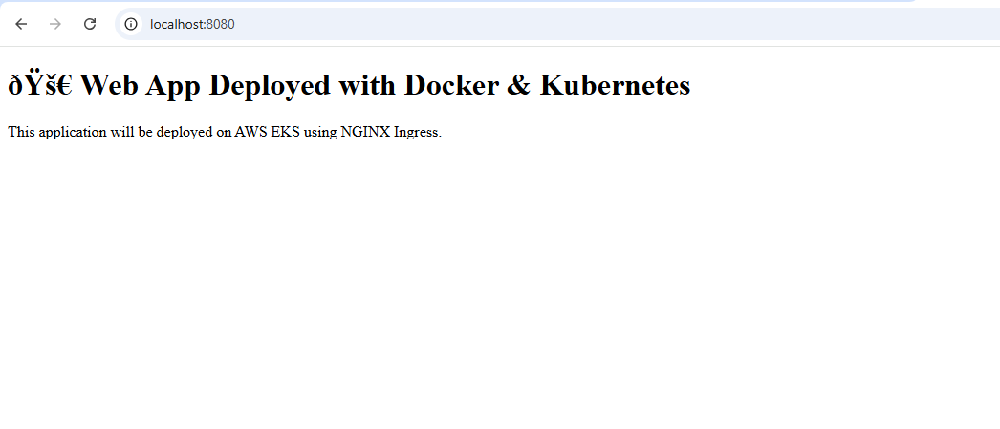
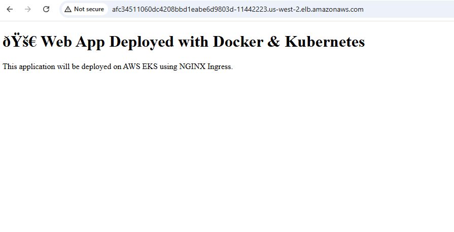

- Simulated load using ApacheBench:
```bash
kubectl run ab-test --image=httpd:2.4 --restart=Never -it --rm -- /bin/bash
ab -n 1000 -c 10 http://afc34511060dc4208bbd1eabe6d9803d-11442223.us-west-2.elb.amazonaws.com>/
```

### I added Screenshots
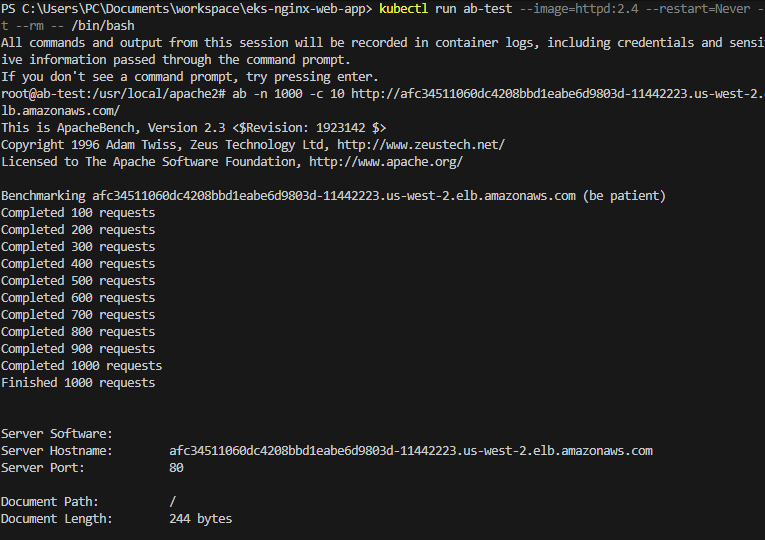
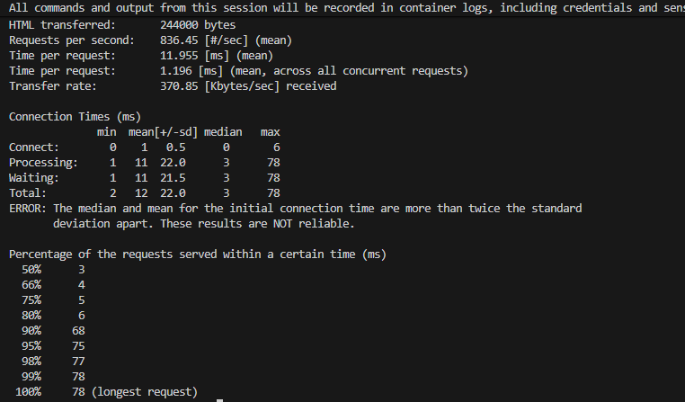

---

## Project Structure
```
eks-nginx-web-app/
├─ k8s/
│  ├─ deployment.yaml
│  ├─ service.yaml
│  └─ ingress.yaml
├─ .github/
│  └─ workflows/
│     └─ deploy.yml
├─ Dockerfile
├─ helm/
├─ README.md
```

---


## Project Repository

You can find the complete source code for this project in the GitHub repository:

[https://github.com/BigOronaa/eks-nginx-web-app](https://github.com/BigOronaa/eks-nginx-web-app)


