# Lab Guide: Deploying a Web Application on GKE with Helm, NGINX Ingress, Cert-Manager, Vault, and CI/CD

## Project Overview
In this project, I deployed a web application on Google Kubernetes Engine (GKE) using Helm charts. The application was containerized with Docker and stored in Google Artifact Registry. I implemented NGINX Ingress for traffic routing, cert-manager for TLS certificates, Vault for secrets management, and automated the deployment using a GitHub Actions CI/CD pipeline.


## Step 1: Prepare the Docker Image

I wrote a Dockerfile for the web application:

```dockerfile
FROM nginx:latest
COPY . /usr/share/nginx/html
EXPOSE 80
```

I then built and pushed the Docker image to Google Artifact Registry:

```bash
docker build -t us-central1-docker.pkg.dev/project-525a47ad-8a94-41ce-85d/gke-web-app/web-app:latest .
gcloud auth configure-docker us-central1-docker.pkg.dev
docker push us-central1-docker.pkg.dev/project-525a47ad-8a94-41ce-85d/gke-web-app/web-app:latest
```

### I added Screenshots
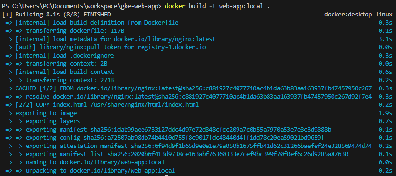
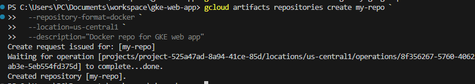
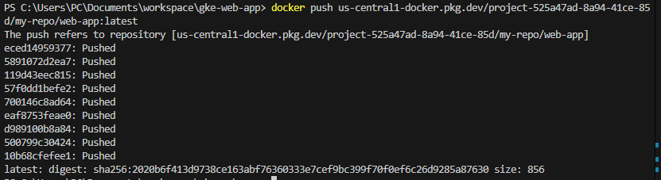


## Step 2: Set Up GKE Cluster

I created a GKE cluster:

```bash
gcloud container clusters create my-cluster \
   --zone us-central1-a \
   --num-nodes 2 \
   --machine-type e2-medium
```

### I added Screenshots


Verified the cluster:

```bash
kubectl get nodes
```

### I added Screenshots
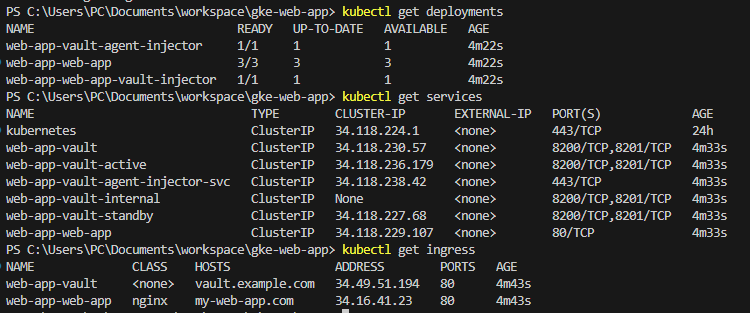

## Step 3: Install NGINX Ingress, Cert-Manager, and Vault

### NGINX Ingress

```bash
helm repo add ingress-nginx https://kubernetes.github.io/ingress-nginx
helm repo update
helm install ingress-nginx ingress-nginx/ingress-nginx --namespace ingress-nginx --create-namespace
```

### I added Screenshots
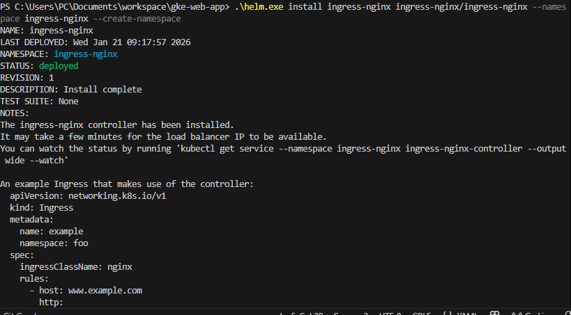

### Cert-Manager

```bash
helm repo add jetstack https://charts.jetstack.io
helm repo update
helm install cert-manager jetstack/cert-manager --namespace cert-manager --create-namespace --set installCRDs=true
```

### I added Screenshots
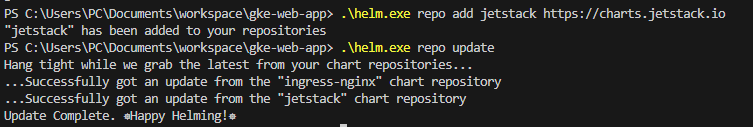

Created ClusterIssuer:

```yaml
apiVersion: cert-manager.io/v1
kind: ClusterIssuer
metadata:
   name: letsencrypt-prod
spec:
   acme:
      server: https://acme-v02.api.letsencrypt.org/directory
      email: my-email@example.com
      privateKeySecretRef:
         name: letsencrypt-prod
      solvers:
      - http01:
            ingress:
               class: nginx
```

Applied ClusterIssuer:

```bash
kubectl apply -f cluster-issuer.yaml
```


### Vault

```bash
helm repo add hashicorp https://helm.releases.hashicorp.com
helm repo update
helm install vault hashicorp/vault --namespace vault --create-namespace
```

### I added Screenshots
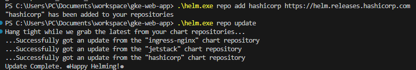

## Step 4: Deploy the Web Application Using Helm

I created a Helm chart `web-app` with templates for deployment, service, ingress, configmap, secret, service account, and Vault injector.

Installed the chart:

```bash
helm dependency update web-app
helm install web-app ./web-app --namespace default
```
### I added Screenshots
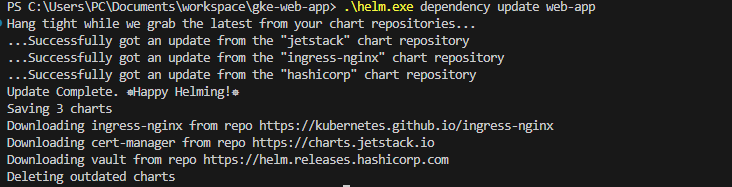
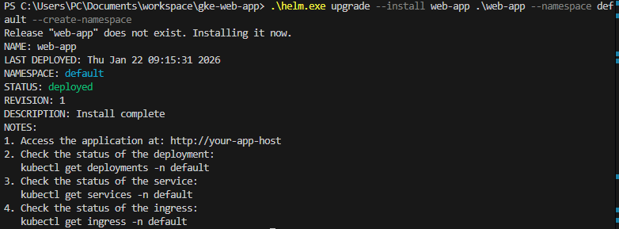

Verified the deployment:

```bash
kubectl get deployments,services,ingress -n default
```

### I added Screenshots
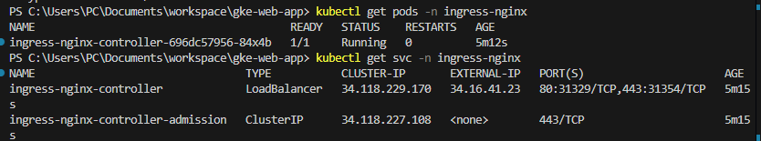


## Step 5: Set Up CI/CD Pipeline

Created GitHub Actions workflow `.github/workflows/deploy.yml`:
- Job `build-and-push` to build and push Docker image.
- Job `deploy` to authenticate with GCP, configure kubectl, and deploy using Helm.

### I added Screenshots
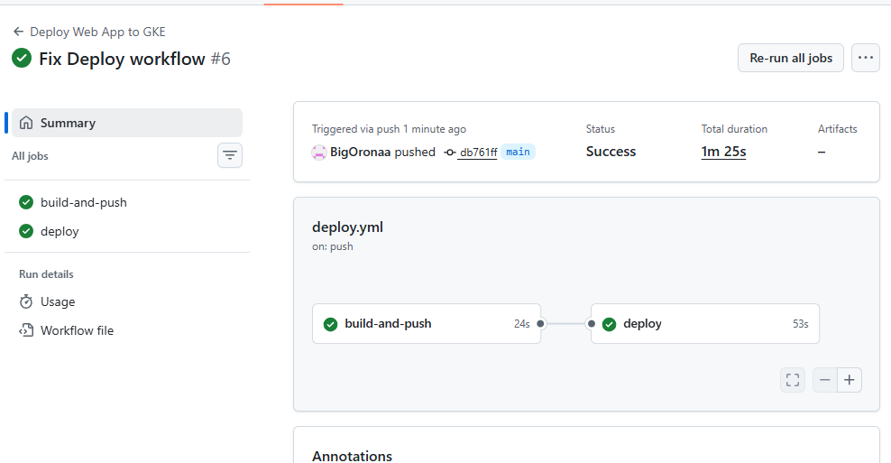

**Error Encountered:**
- Initially faced `google-github-actions/auth` error: `$ACTIONS_ID_TOKEN_REQUEST_TOKEN` not injected. Resolved by setting proper repository permissions and workflow permissions.
- `gke-gcloud-auth-plugin not found` during deployment; fixed by installing the plugin in the workflow.

Secrets added in GitHub:
- `GCP_PROJECT_ID`
- `GCP_SA_KEY`

### I added Screenshots
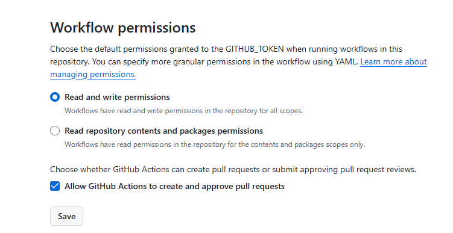
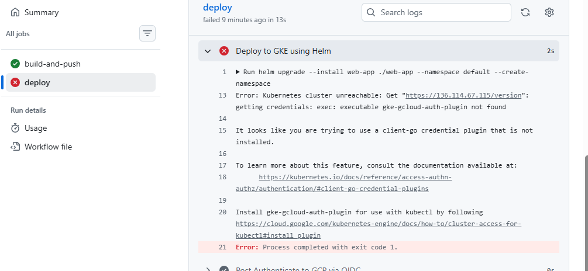
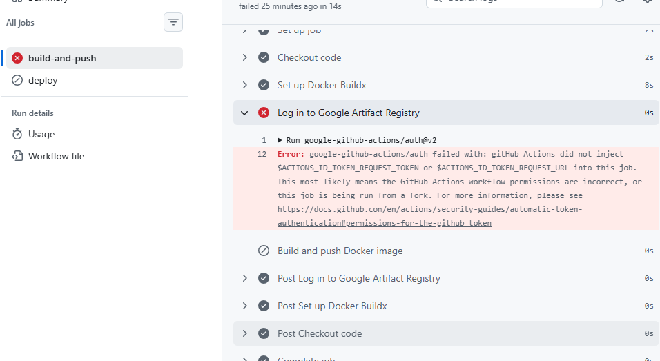


## Step 6: Test the Application

Verified the application by accessing the Ingress host (or via port-forward for local testing):

```bash
kubectl port-forward svc/web-app-web-app 8080:80 -n default
curl http://127.0.0.1:8080
```

### I added Screenshots
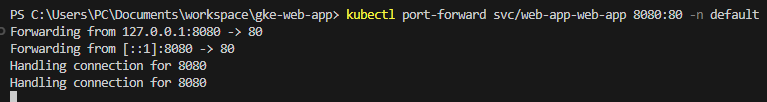
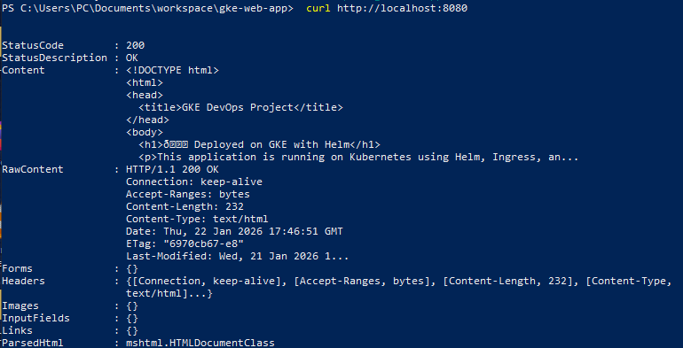


## Conclusion

I successfully deployed a fully automated GKE application with Helm, NGINX Ingress, cert-manager, and Vault. The CI/CD pipeline builds and pushes the Docker image, and deploys the app automatically. Issues encountered were mostly authentication and plugin-related, which I resolved step by step.

---


## Project Repository

You can find the complete source code for this project in the GitHub repository:

[https://github.com/BigOronaa/gke-web-app](https://github.com/BigOronaa/gke-web-app)
