# Configuring Autoscaling, Load Balancing Project


## Overview
This project demonstrates how to configure a Kubernetes-based web application to handle high traffic efficiently and reliably. The focus is on implementing **Horizontal Pod Autoscaling (HPA)**, **Load Balancing**, and **Readiness/Liveness Probes** to ensure availability, scalability, and resilience under load.

The application used is a simple NGINX web server deployed on Kubernetes, but the concepts and configurations apply to real-world production workloads.

---

## Project Objectives

- Deploy a containerized web application on Kubernetes
- Configure **Horizontal Pod Autoscaler (HPA)** to scale pods based on CPU usage
- Implement **Load Balancing** using a Kubernetes Service
- Configure **Readiness and Liveness Probes** to manage pod health
- Validate the setup under simulated high traffic
- Document challenges and solutions encountered during implementation


## Step 1: Local Kubernetes Cluster Setup

I created a local folder named `k8s-traffic-scaling` to host all project files and initialized it as a Git repository. I then pushed the repository to GitHub to ensure version control and backup of my work.

I installed Minikube on my system and verified its version to ensure that the Kubernetes CLI tool was available. I also made sure Docker was installed and running, as I planned to use the Docker driver for the cluster.

I started the Minikube cluster using the Docker driver. The cluster initialized a control-plane node, configured the necessary networking (CNI), generated certificates and keys, and enabled required addons such as the storage provisioner and default storage class.

```bash
C:\minikube\minikube.exe start --driver=docker
```

### I added Screenshots


After the cluster started, I verified that the Kubernetes node was running and ready to accept workloads using kubectl.

```bash
kubectl get nodes
```

### I added Screenshots
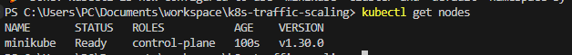


## Step 2: Application Deployment with Health Probes

I created a directory named `manifests` to store Kubernetes YAML files for this project. I then created a deployment manifest `deployment.yaml` to define the web application using the NGINX image. 

I included readiness and liveness probes in the deployment. The readiness probe ensures that only healthy pods receive traffic, while the liveness probe restarts containers that become unresponsive.

I applied the deployment to the Minikube cluster using the command
```bash
kubectl apply -f manifests\deployment.yaml
```
 
### I added Screenshots
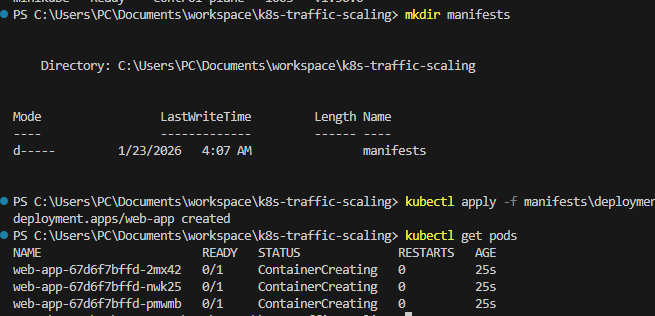


I noticed that the pods could not initially pull the image due to network constraints. To resolve this, I accessed the Minikube environment using `minikube ssh` and manually pulled the `nginx:latest` image:


### I added Screenshots
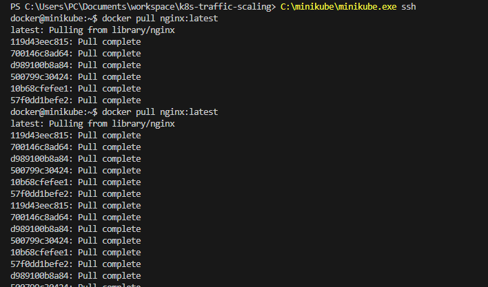


I then deleted the old pods to allow Kubernetes to recreate them using the newly pulled image:

### I added Screenshots
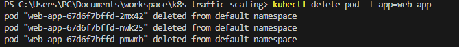

Finally, I confirmed that both readiness and liveness probes were active and succeeded, ensuring that the application was healthy and ready to serve traffic.

### I added Screenshots
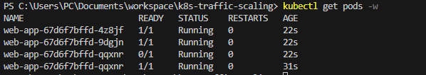


## Step 3: Configure Horizontal Pod Autoscaler (HPA)

I created a Horizontal Pod Autoscaler (HPA) manifest `hpa.yaml` under the `manifests` directory using the stable API version `autoscaling/v1`. The HPA was configured to monitor CPU usage of the `web-app` deployment and automatically scale replicas between 3 and 10 when CPU usage exceeded 50%.

I applied the HPA configuration to the cluster using:
```bash
kubectl apply -f manifests/hpa.yaml
```

### I added Screenshots
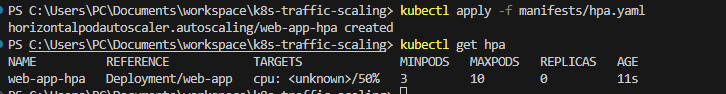


I verified that the HPA was created successfully and was monitoring the deployment:

```bash
kubectl get hpa
```

### I added Screenshots


This ensures that the application can automatically scale to handle increased traffic while maintaining performance.


## Step 4: Configure LoadBalancer Service

I created a Kubernetes Service manifest `service.yaml` under the `manifests` directory to expose the web application to external traffic. The service was configured as a `LoadBalancer` type to distribute traffic across all available pods in the deployment.

I applied the service configuration using:
```bash
kubectl apply -f manifests/service.yaml
```

### I added Screenshots
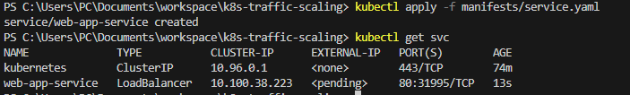


I verified the service creation and obtained the external URL using:
```bash
kubectl get svc
```

### I added Screenshots


## Step 5: Test Traffic

I installed ApacheBench (ab) to simulate HTTP traffic and verified connectivity to the deployed pods using port-forward:

```bash
kubectl port-forward svc/web-app-service 9090:80
ab -n 1000 -c 100 http://127.0.0.1:9090/
```

### I added Screenshots
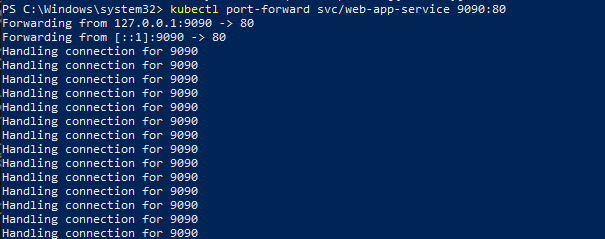
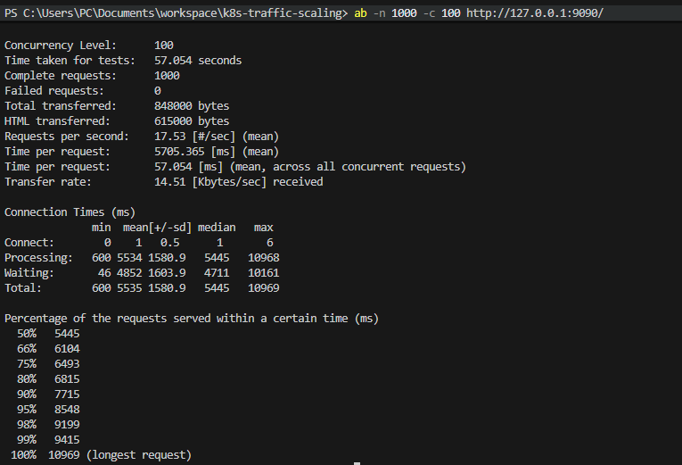

All 1000 requests completed successfully with 0 failed requests. The pods served traffic correctly.

I Observed the number of pods scaling up and down.
```bash
kubectl get hpa
kubectl get pods
```
### I added Screenshots


Verify that only healthy pods are serving traffic.
```bash
kubectl describe pod web-app-c79b76c4-65x4j
```
### I added Screenshots


### Challenges Faced and Solutions

HPA Showing <unknown> CPU:

Challenge: The HPA did not show CPU utilization.

Solution: I ensured the metrics-server was installed and running:

```bash
kubectl get pods -n kube-system
```

### I added Screenshots
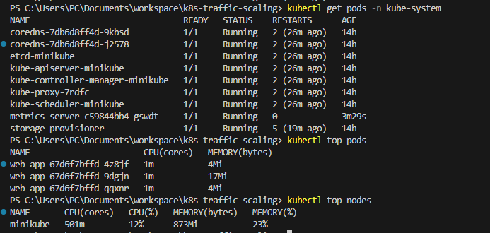
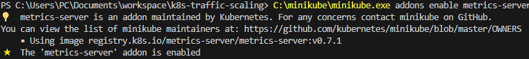


### Reflection and Learning

From this project, I learned:

- How to deploy a stateless web application on Kubernetes with health probes.
- How to expose deployments via services and test traffic using port-forwarding and ApacheBench.
- How to configure and monitor Horizontal Pod Autoscalers.
- How to troubleshoot real-world issues like pod crashes, metrics not appearing, and port conflicts.
- I gained confidence in reading pod events, describing resources, and understanding container lifecycle issues.

**Overall, this project significantly improved my hands-on Kubernetes skills, particularly in deployment, scaling, and monitoring in a local cluster environment.**


## Project Repository

You can find the complete source code for this project in the GitHub repository:
[https://github.com/BigOronaa/k8s-traffic-scaling](https://github.com/BigOronaa/k8s-traffic-scaling)
