# Lab Guide: Implementing Kubernetes Autoscaling, Load Balancing, and Health Probes

## Project Objective

In this lab, I implemented a Kubernetes deployment with autoscaling, load balancing, and health probes to manage pod availability and traffic efficiently. I also tested horizontal pod autoscaling (HPA) and configured liveness and readiness probes to monitor pod health.

## Prerequisites
- A running Kubernetes cluster
- kubectl installed and configured
- Basic knowledge of YAML and Kubernetes objects

### Implementation Steps

## Step 1: Deploy a Sample Application
- I created a working directory for the project:
```bash
mkdir k8s-lab && cd k8s-lab
```

- I created a subdirectory for Kubernetes configuration files:
```bash
mkdir configs
```

### I added Screenshots
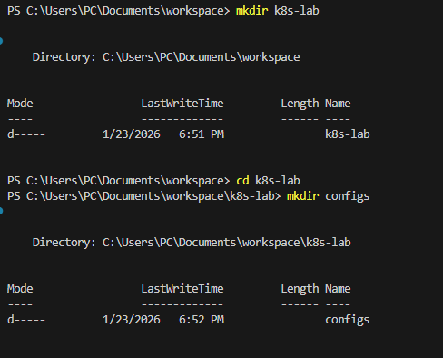

- I created a Deployment YAML file at configs/deployment.yaml with the following content to deploy an NGINX container. 
- I applied the deployment to my Kubernetes cluster:
```bash
kubectl apply -f configs/deployment.yaml
```
- I verified that the deployment was successfully created:
```bash
kubectl get deployments
```

### I added Screenshots
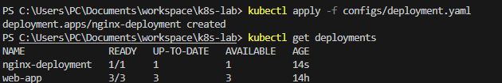

- I successfully deployed the NGINX application on Kubernetes. The deployment was ready, and the pod was running, which prepared the environment for the next steps (exposing the service and configuring autoscaling).


## Step 2: Expose the Application and Retrieve the Cluster IP
- I exposed the NGINX deployment internally within the cluster so I could test it and prepare for autoscaling.
- I exposed the deployment as a ClusterIP service:
```bash
kubectl expose deployment nginx-deployment --type=ClusterIP --port=80
```
- I verified that the service was created and retrieved its Cluster IP:
```bash
kubectl get svc nginx-deployment
```

### I added Screenshots
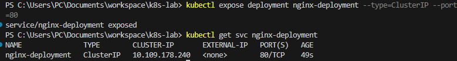

I successfully exposed the NGINX deployment internally. I noted the Cluster IP (10.109.178.240) which I would use later to test Horizontal Pod Autoscaling by simulating load.


## Step 3: Configure Horizontal Pod Autoscaling (HPA)
- I configured autoscaling for the NGINX deployment so that the number of pods would automatically adjust based on CPU usage.
- I updated the deployment YAML (configs/deployment.yaml) to include CPU resource requests and limits. This is required for HPA to monitor CPU usage: 
```yaml
resources:
  requests:
    cpu: 100m
  limits:
    cpu: 500m
```

- I applied the updated deployment to the cluster:
```bash
kubectl apply -f configs/deployment.yaml
```

- I created a Horizontal Pod Autoscaler (HPA) for the deployment to scale pods based on CPU usage:
```bash
kubectl autoscale deployment nginx-deployment --cpu-percent=50 --min=1 --max=5
```

- I verified that the HPA was created successfully:
```bash
kubectl get hpa
```

### I added Screenshots
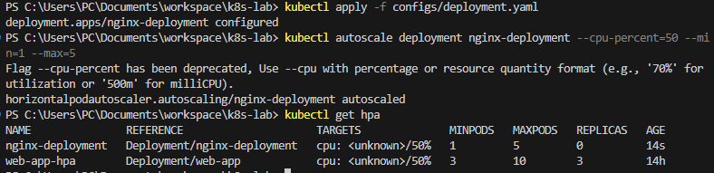

- I simulated CPU load on the NGINX deployment to trigger the Horizontal Pod Autoscaler (HPA) and observe pod scaling.
- I created a temporary BusyBox pod inside the cluster to generate load:
```bash
kubectl run curlpod --image=busybox --restart=Never -it -- sh
```
This opened a Linux shell inside the pod, allowing me to access the ClusterIP service.
- Inside the pod shell, I tested connectivity to the NGINX service:
```bash
wget -qO- http://nginx-deployment.default.svc.cluster.local
```
I confirmed that the NGINX welcome page HTML was returned, proving the service was reachable.

### I added Screenshots
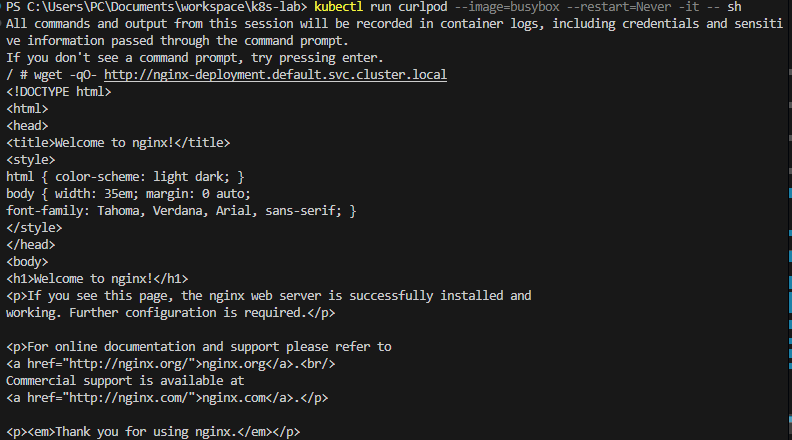

- I simulated CPU load by sending multiple requests to the service:
```bash
for i in $(seq 1 100); do wget -qO- http://nginx-deployment.default.svc.cluster.local; done
```
### I added Screenshots
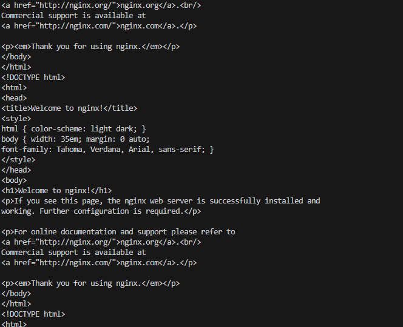

- After sending requests, I checked the HPA status from my host terminal:
```bash
kubectl get hpa
```
### I added Screenshots
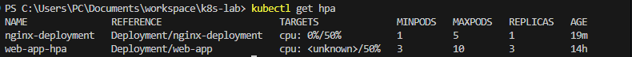


## Step 4: Set Up Load Balancer Service for External Access
- I exposed the NGINX deployment externally using a LoadBalancer so that it could be accessed from outside the cluster.
- I deleted the existing ClusterIP service to prepare for a LoadBalancer service:
```bash
kubectl delete svc nginx-deployment
```
I exposed the deployment as a LoadBalancer:
```bash
kubectl expose deployment nginx-deployment --type=LoadBalancer --port=80
```
### I added Screenshots
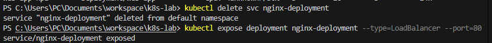

The external IP was still pending, so i Expose the deployment as a NodePort service:
```bash
kubectl expose deployment nginx-deployment --type=NodePort --port=80
```
### I added Screenshots
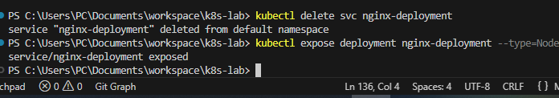

I got the service details:
```bash
kubectl get svc nginx-deployment
```

-I created a temporary BusyBox pod inside the cluster to test the service:
```bash
kubectl run curlpod --image=busybox --restart=Never -it -- sh
```
` Inside the pod shell, I tested connectivity to the NGINX service:
```bash
wget -qO- http://nginx-deployment.default.svc.cluster.local
```
### I added Screenshots


## Step 5: Add Liveness and Readiness Probes
- I configured liveness and readiness probes for the NGINX deployment to monitor pod health and ensure traffic is only sent to healthy pods.
- I updated the deployment YAML (configs/deployment.yaml) to include probes under the container specification:
```yaml
spec:
  containers:
  - name: nginx
    image: nginx
    ports:
    - containerPort: 80
    resources:
      requests:
        cpu: "100m"
      limits:
        cpu: "500m"
    livenessProbe:
      httpGet:
        path: /
        port: 80
      initialDelaySeconds: 10
      periodSeconds: 5
    readinessProbe:
      httpGet:
        path: /
        port: 80
      initialDelaySeconds: 5
      periodSeconds: 5
```

- I applied the updated deployment:
```bash
kubectl apply -f configs/deployment.yaml
```

- I verified the probes by describing a pod:
```bash
kubectl get pods
kubectl describe pod nginx-deployment-7dd9867f65-chjb7
```
### I added Screenshots
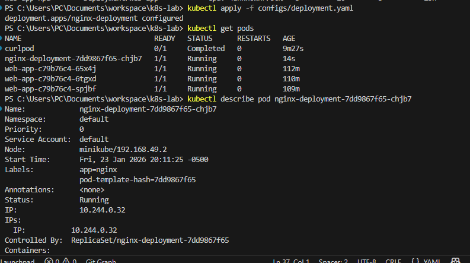
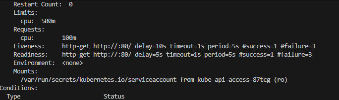

- when I simulated a pod failure to test the liveness probe it failed with error unable to start container process: exec: "pkill": executable file not found in $PATH: unknown

- I tried with the command:
```bash
kubectl exec -it <pod-name> -- nginx -s stop
```
### I added Screenshots
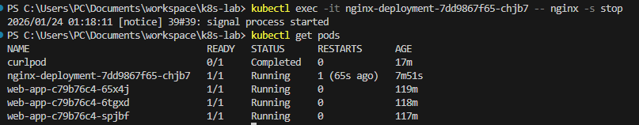


### Step 6: Clean Up Resources
- I deleted all the resources
```bash
kubectl delete hpa nginx-deployment
kubectl delete svc nginx-deployment
kubectl delete deployment nginx-deployment
```
### I added Screenshots
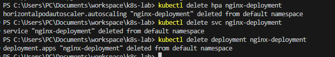

- I Verified Deletion
```bash
kubectl get all
```

## Conclusion
In this lab, I deployed an NGINX application on Kubernetes and exposed it using a ClusterIP service. I configured CPU requests and limits and set up a Horizontal Pod Autoscaler (HPA), simulating load from a temporary pod inside the cluster to verify automatic scaling.

I also added liveness and readiness probes to monitor pod health, confirming that unhealthy pods were restarted and only ready pods received traffic. Finally, I cleaned up all resources, demonstrating that I can deploy, autoscale, monitor, and manage a Kubernetes application effectively.