## Automating CI/CD for a Node.js Application on Kubernetes with Quality Gates Project

## Objectives
In this project, I set up a Kubernetes cluster and deployed a Node.js application using a CI/CD pipeline. The pipeline includes unit testing, SonarQube integration for code quality checks, and Docker image creation. I also configured Ingress Nginx, cert-manager, and a ClusterIssuer for secure traffic routing. The goal was to ensure the application meets a 40% code coverage threshold and passes the SonarQube quality gate before deployment.

## Deliverables
- **Kubernetes Cluster**: Fully functional with SonarQube, Ingress Nginx, cert-manager, and ClusterIssuer installed.
- **CI/CD Pipeline**: Builds Docker image, runs unit tests, integrates with SonarQube, and pushes image to Docker Hub.
- **Dockerfile**: Dockerfile for the Node.js application.

## Implementation steps

## Task 1: Set Up a Kubernetes Cluster
- I set up a Kubernetes cluster and installed SonarQube, Ingress Nginx, cert-manager, and a ClusterIssuer to support secure deployment and code quality checks.

- I Created the Kubernetes Cluster
- I used Minikube as my local cluster environment for testing purposes:
```bash
minikube start 
```

- I verified the cluster was running:
```bash
kubectl get nodes
```

I Installed SonarQube, I deployed SonarQube using Helm:
```bash
helm repo add sonarqube https://SonarSource.github.io/helm-chart-sonarqube
helm repo update
helm install sonarqube sonarqube/sonarqube
```

### I added ScreenshotsS
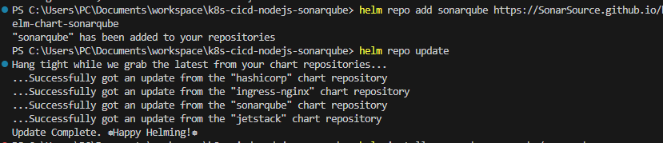
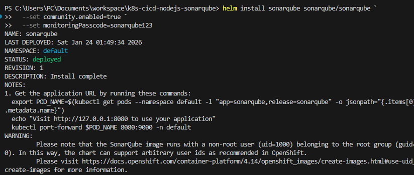

**Error Encountered:** I attempted to deploy SonarQube using the official Helm chart, but the installation failed due to a missing required monitoring passcode. I resolved this by explicitly providing a monitoringPasscode value during the Helm installation. ALso I encountered a validation error requiring the selection of a SonarQube edition. Since this project is a learning and CI/CD demonstration environment, I deployed the SonarQube Community Build by enabling community.enabled=true and providing the required monitoring passcode. This allowed the installation to proceed successfully.

### I added ScreenshotsS
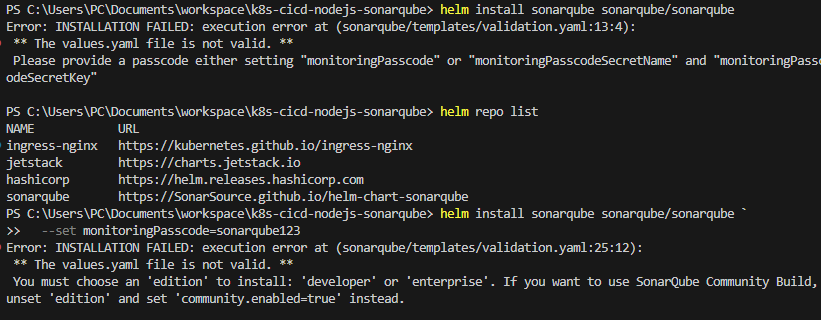


- Installed Ingress Nginx, I deployed Ingress Nginx to handle external HTTP traffic:
```bash
kubectl apply -f https://raw.githubusercontent.com/kubernetes/ingress-nginx/controller-v1.9.1/deploy/static/provider/cloud/deploy.yaml
```

### I added ScreenshotsS
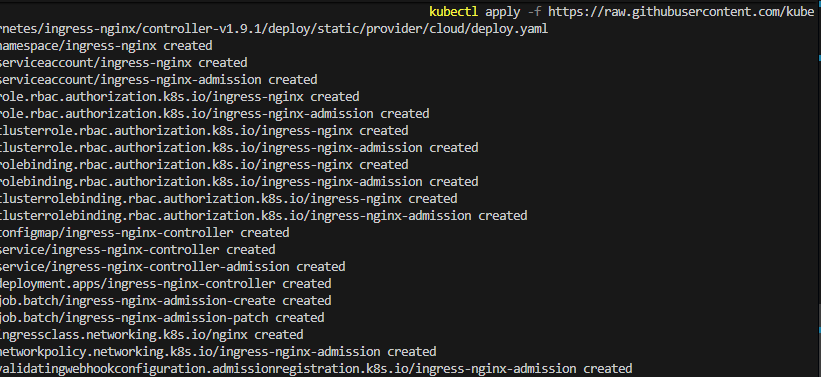


- I verified the Ingress controller was ready:
```bash
kubectl get pods -n ingress-nginx
```

### I added ScreenshotsS
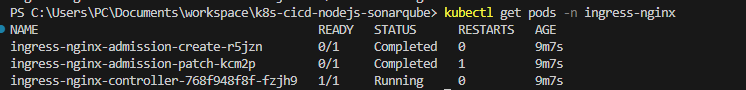


-Installed cert-manager and ClusterIssuer, I installed cert-manager to automate TLS certificate management:
```bash
kubectl apply -f https://github.com/cert-manager/cert-manager/releases/download/v1.12.0/cert-manager.yaml
```
### I added ScreenshotsS
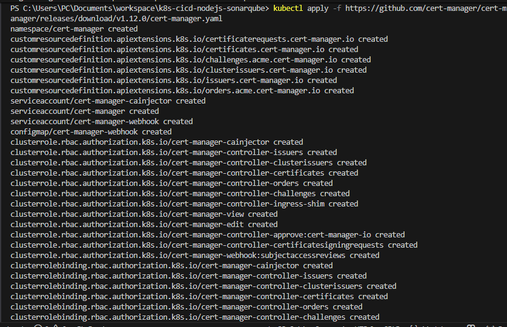

- I created a ClusterIssuer for Let's Encrypt 
```yaml
apiVersion: cert-manager.io/v1
kind: ClusterIssuer
metadata:
  name: letsencrypt
spec:
  acme:
    server: https://acme-v02.api.letsencrypt.org/directory
    email: youremail@example.com
    privateKeySecretRef:
      name: letsencrypt-key
    solvers:
    - http01:
        ingress:
          class: nginx
```
- I applied it with:
```bash
kubectl apply -f clusterissuer.yaml
```

## Task 2: Configure GitHub Actions

- I created a GitHub Actions workflow `.github/workflows/ci-cd.yaml` to automate the CI/CD pipeline. The workflow:
- Checks out the code.
- Sets up Node.js 16.
- Installs dependencies and runs unit tests.
- Sends the code to SonarQube for quality checks.
- Builds a Docker image and pushes it to Docker Hub if all tests and quality gates pass.

- I Generated a SonarQube authentication token
- I logged into the SonarQube dashboard and generated a User Token (not a global analysis token), because user tokens are recommended for CI/CD authentication.

### I added ScreenshotsS
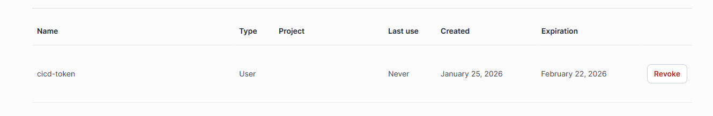

- The Pipeline passed and pushed the docker image to dockerhub.

### I added ScreenshotsS
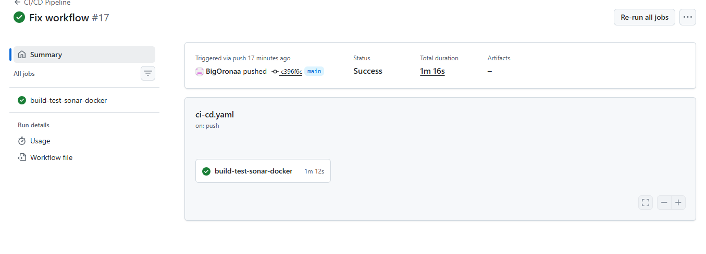
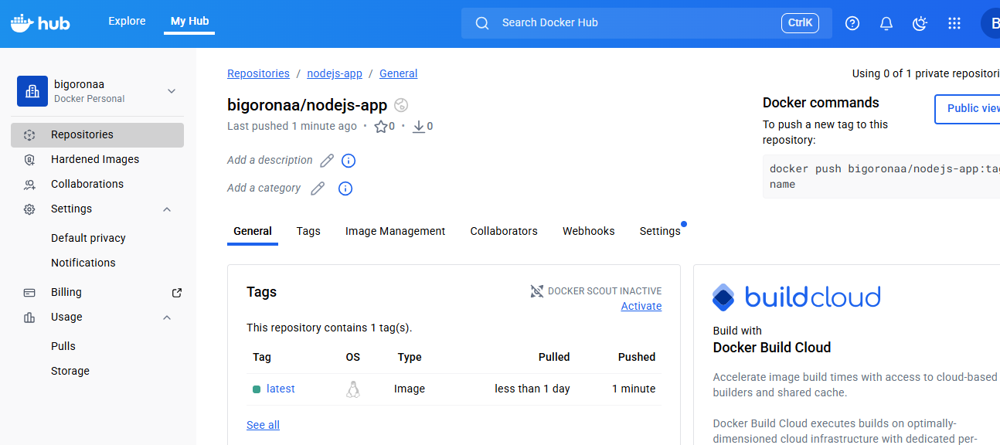

- I Configured the pipeline to fail if the 40% code coverage threshold is not met or if the quality gate is not passed.

### I added ScreenshotsS
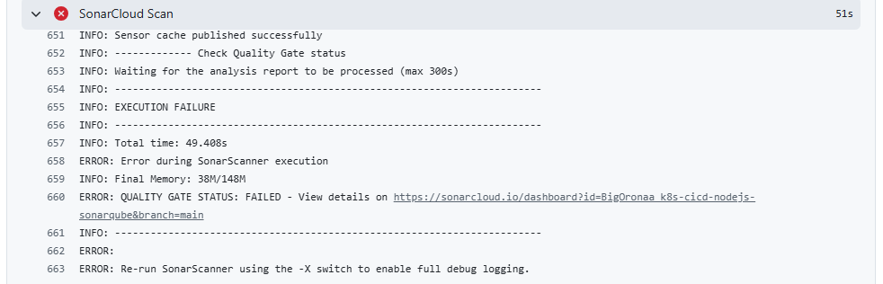

**Challenge:** My first attempt failed because the SonarCloud GitHub Action didn’t recognize projectKey and organization in the with block.

**Solution:** I moved these properties to the args input and set sonar.qualitygate.wait=true to enforce quality gate checks.


## Task 3: Dockerfile Creation for Node.js Application

- I Created a Dockerfile for the Node.js application to containerize it, allowing consistent deployment across environments.
- I ensured the Dockerfile works as expected, I built the docker image using the command:
```bash
docker build -t bigoronaa/nodejs-app:latest .
```

### I added ScreenshotsS
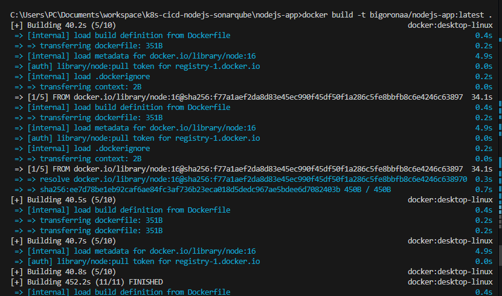
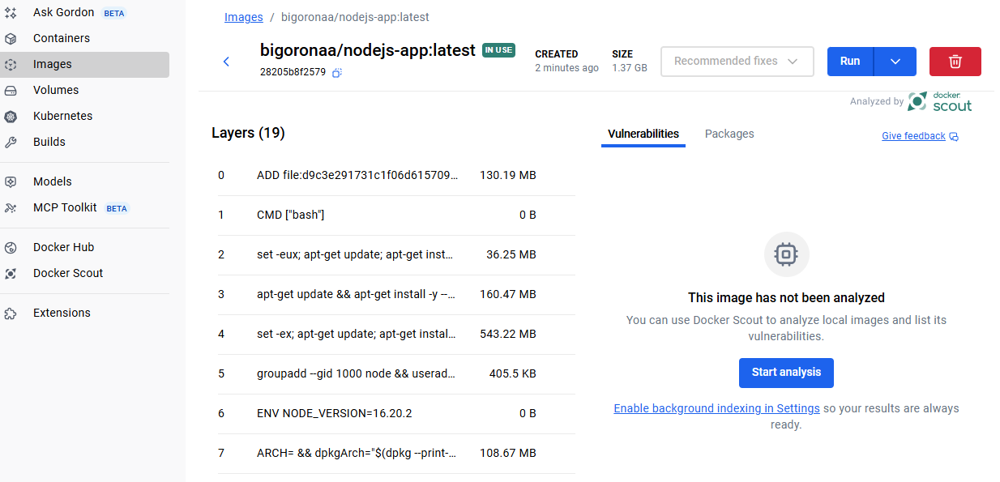

- I ran the Docker container with:
```bash
docker run -p 3000:3000 bigoronaa/nodejs-app:latest
```
- I Verified the application runs.

### I added ScreenshotsS
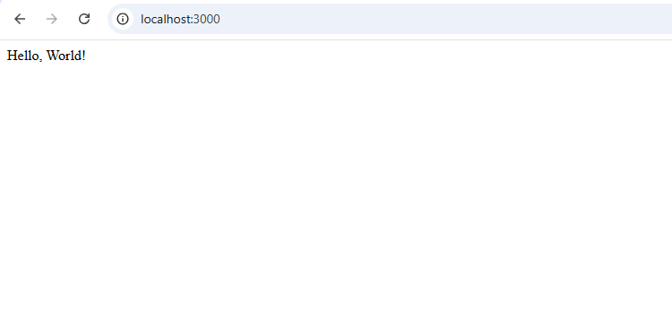


## Task 4: Deploy the Node.js Application to Kubernetes

I Deployed the Node.js application to the Kubernetes cluster using Deployment, Service, and Ingress manifests, ensuring it is accessible externally with TLS configured.

- I Created the Kubernetes Manifests and I wrote the Kubernetes manifests to deploy the Node.js application:
```yaml
Deployment (deployment.yaml):

apiVersion: apps/v1
kind: Deployment
metadata:
  name: nodejs-app-deployment
  labels:
    app: nodejs-app
spec:
  replicas: 3
  selector:
    matchLabels:
      app: nodejs-app
  template:
    metadata:
      labels:
        app: nodejs-app
    spec:
      containers:
        - name: nodejs-app
          image: bigoronaa/nodejs-app:latest
          ports:
            - containerPort: 3000


Service (service.yaml):

apiVersion: v1
kind: Service
metadata:
  name: nodejs-app-service
spec:
  type: ClusterIP
  selector:
    app: nodejs-app
  ports:
    - port: 80
      targetPort: 3000


Ingress (ingress.yaml):

apiVersion: networking.k8s.io/v1
kind: Ingress
metadata:
  name: nodejs-app-ingress
  annotations:
    kubernetes.io/ingress.class: nginx
    cert-manager.io/cluster-issuer: letsencrypt-prod
spec:
  rules:
    - host: nodejs-app.example.com
      http:
        paths:
          - path: /
            pathType: Prefix
            backend:
              service:
                name: nodejs-app-service
                port:
                  number: 80
  tls:
    - hosts:
        - nodejs-app.example.com
      secretName: nodejs-app-tls
```

- I deployed the application to the Kubernetes cluster using the following commands:
```bash
kubectl apply -f deployment.yaml
kubectl apply -f service.yaml
kubectl apply -f ingress.yaml
```

### I added ScreenshotsS
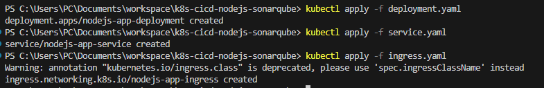

- I verified that the application is running and accessible:
```bash
kubectl get pods
```

- Confirmed Service is running:
```bash
kubectl get svc nodejs-app-service
```
- Checked Ingress and TLS configuration:
```bash
kubectl get ingress nodejs-app-ingress
```
### I added ScreenshotsS
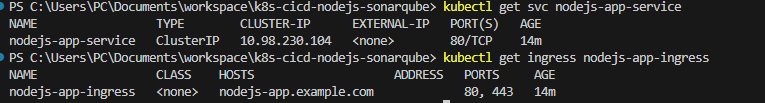


## Reflection and Learning

- I learned how to create a full CI/CD pipeline for a Node.js application, integrating testing, code quality, and Dockerization.
- I gained practical experience in SonarCloud configuration, including enforcing quality gates.
- I improved my understanding of Kubernetes deployments, services, and ingress management.
- Overall, this project strengthened my DevOps skills in automating deployments, debugging workflow issues, and handling containerized applications in Kubernetes.


## Project Repository

You can find the complete source code for this project in the GitHub repository:
[https://github.com/BigOronaa/k8s-cicd-nodejs-sonarqube](https://github.com/BigOronaa/k8s-cicd-nodejs-sonarqube)


