# Deploying a Multi-Namespace Project

## Objectives

In this project, I set up an AWS EKS cluster, deployed the Kubernetes Dashboard, created multiple namespaces with pods, and monitored resources using Metrics Server. The goal was to demonstrate my ability to manage Kubernetes resources, monitor workloads, and maintain cluster observability in a multi-namespace environment.

## Project Deliverables

1. **AWS EKS Cluster:** A fully functional EKS cluster with 2 worker nodes.
2. **Kubernetes Dashboard:** Installed and accessible for monitoring the cluster.
3. **Namespaces and Pods:** 5 namespaces (`dev`, `test`, `staging`, `prod`, and `monitoring`) each with 1 running NGINX pod.
4. **Resource Monitoring:** Metrics Server installed to track CPU and memory usage.

## Task 1: Set Up AWS EKS Cluster

- I Create an AWS EKS cluster with 2 worker nodes.
- I already Installed eksctl, kubectl, and awscli on my local machine
- I verified each of them by running:
```bash
eksctl version
kubectl version --client
aws --version
```

### I added Screenshots
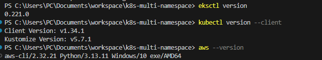

- Using eksctl, I created an EKS cluster with 1 worker nodes in my preferred AWS region and scaled later to two worker nodes, The command I used:
```bash
eksctl create cluster --name multi-namespace-cluster --region us-east-1 --nodegroup-name my-nodes --node-type t3.small --nodes 1 --managed
eksctl scale nodegroup `
--cluster multi-namespace-cluster `
--region us-east-1 `
--name my-nodes `
--nodes 2 `
--nodes-max 3
```

### I added Screenshots
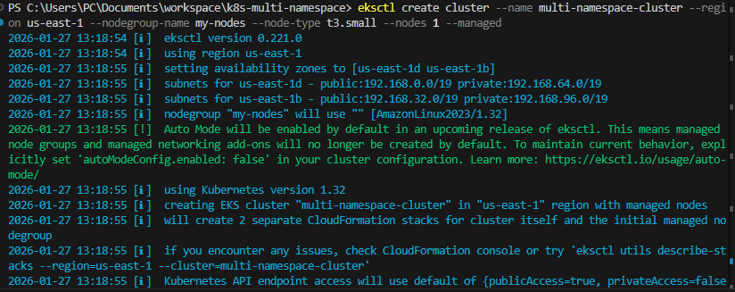
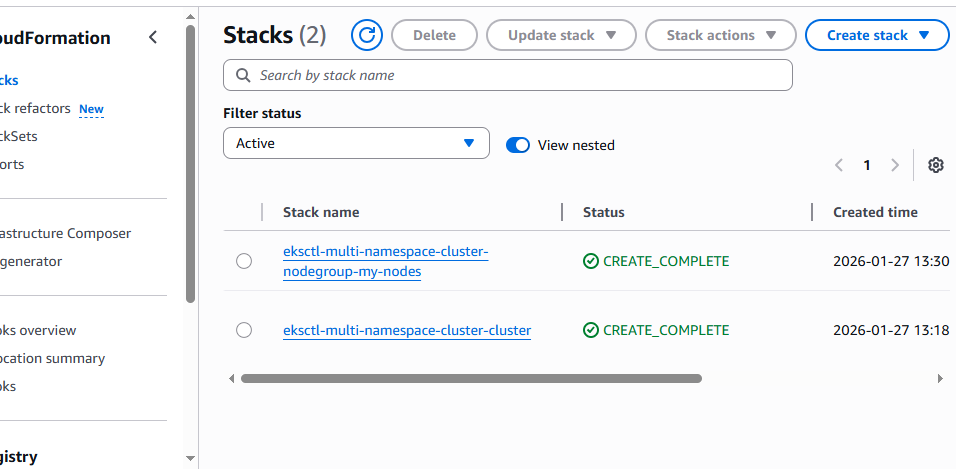
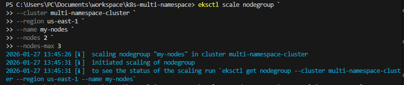

- I verified that the cluster and nodes were running using kubectl
```bash
kubectl get nodes
kubectl get svc
```

### I added Screenshots
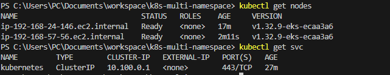


## Task 2: Install Kubernetes Dashboard
- I deployed the Kubernetes Dashboard using Helm to the kubernetes-dashboard namespace:
```bash
helm upgrade --install kubernetes-dashboard kubernetes-dashboard/kubernetes-dashboard --namespace kubernetes-dashboard --create-namespace
```

### I added Screenshots
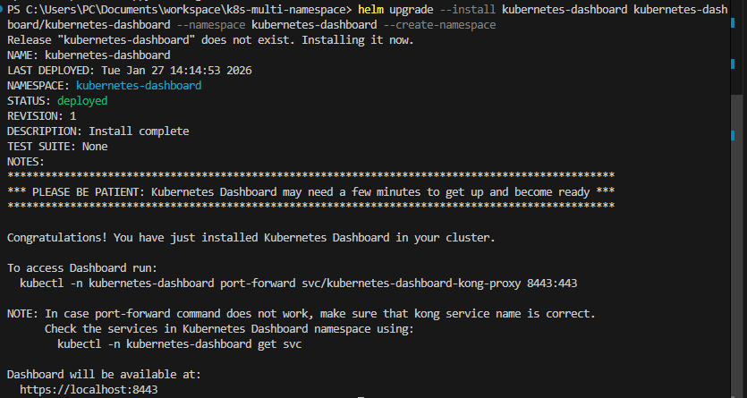

- I confirmed the dashboard pods were running:
```bash
kubectl get pods -n kubernetes-dashboard
```

### I added Screenshots
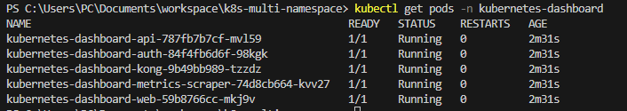


- I created a ServiceAccount and ClusterRoleBinding with cluster-admin privileges to enable full access to cluster resources in a YAML file and applied it.

### I added Screenshots
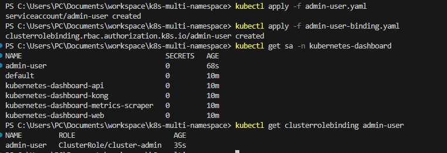

- I generated an authentication token and accessed the dashboard securely using:
```bash
kubectl proxy
```
- I used my local browser to view the Dashboard resources

### I added Screenshots
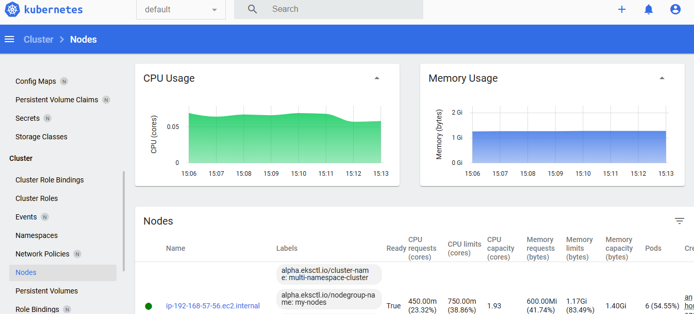


## Task 3: Create Namespaces and Deploy Pods
I created 5 name spaces: dev, test, staging, prod, and monitoring, using the command:
```bash
kubectl create namespace dev
kubectl create namespace test
kubectl create namespace staging
kubectl create namespace prod
kubectl create namespace monitoring
```

### I added Screenshots
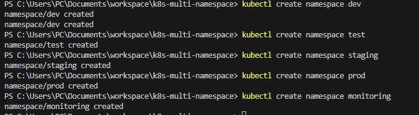

- I created a YAML manifest to deploy 1 NGINX pod per namespace.
```Yaml
apiVersion: v1
kind: Pod
metadata:
  name: nginx
spec:
  containers:
  - name: nginx
    image: nginx:latest
    ports:
    - containerPort: 80
```
- I applied the manifest per namespace using:
```bash
kubectl apply -f nginx-pod.yaml -n dev
kubectl apply -f nginx-pod.yaml -n test
kubectl apply -f nginx-pod.yaml -n staging
kubectl apply -f nginx-pod.yaml -n prod
kubectl apply -f nginx-pod.yaml -n monitoring
```

### I added Screenshots
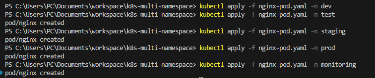

- I Checked the status of the pods in each namespace to ensure they are running using the command:
```bash
kubectl get pods -n dev
kubectl get pods -n test
kubectl get pods -n staging
kubectl get pods -n prod
kubectl get pods -n monitoring
```

## Task 4: Monitor Resources Using Kubernetes Dashboard
- I Use the Kubernetes Dashboard to monitor the namespaces, pods, and nodes in the EKS cluster, and generate insights about resource usage.
- I navigated to the Namespaces section in the dashboard and verified that all five namespaces were present:
    - dev
    - test
    - staging
    - prod
    - monitoring
- For each namespace, I clicked inside to view the pods. I confirmed that each namespace had one NGINX pod running.

### I added Screenshots
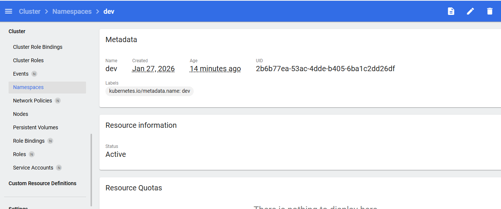
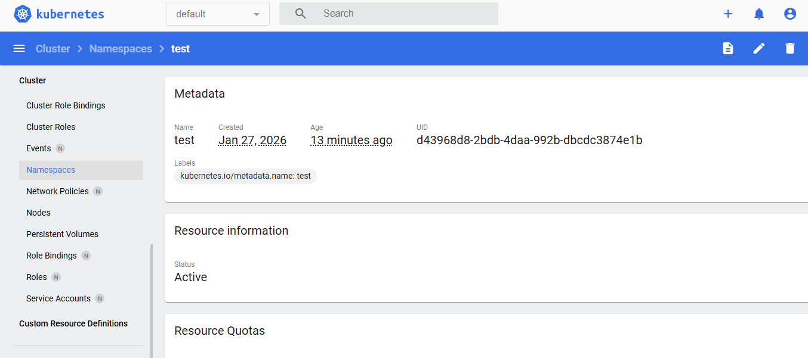
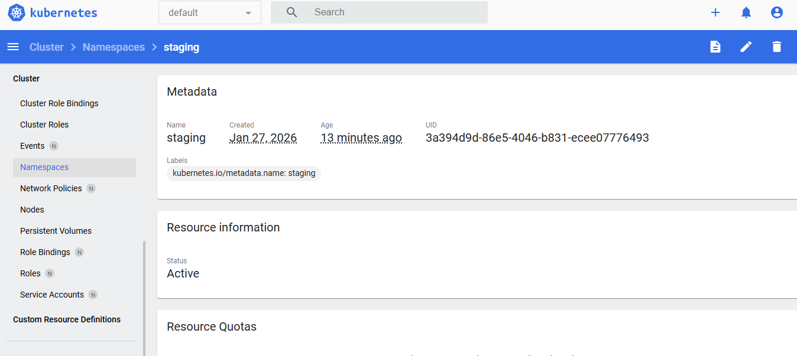
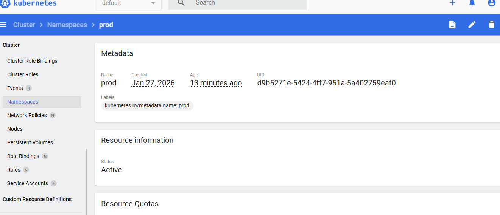
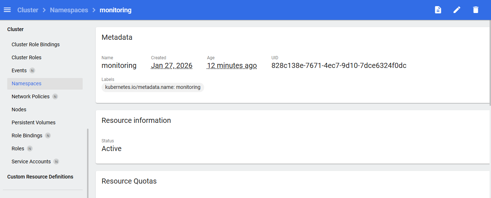

- I went to the Nodes section in the dashboard. I verified that both worker nodes I deployed in Task 1 were Ready.
- I explored each node’s details:
    - Checked CPU and memory usage.
    - Observed the pods assigned to each node.

### I added Screenshots
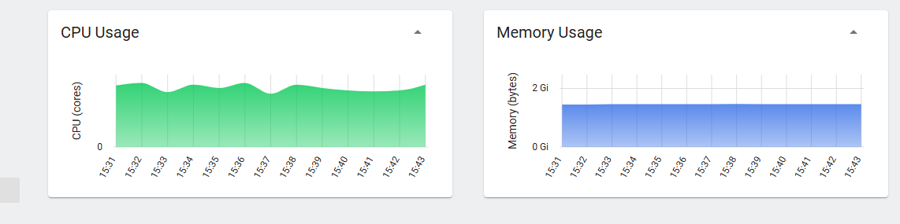
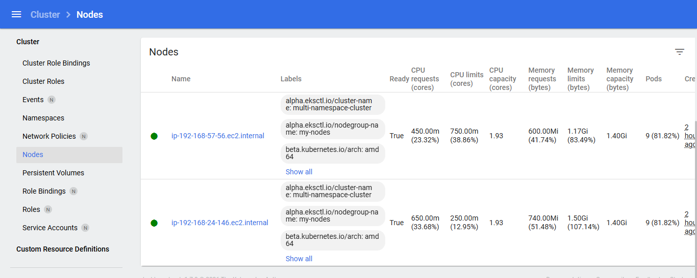

- I Exported resource usage reports for the namespaces and nodes. I used Command-line verification using kubectl to export resources;
```bash
# View all pods in all namespaces
kubectl get pods --all-namespaces -o wide

# View resource usage of nodes
kubectl top nodes

# View resource usage of pods in each namespace
kubectl top pods -n dev
kubectl top pods -n test
kubectl top pods -n staging
kubectl top pods -n prod
kubectl top pods -n monitoring
```

### I added Screenshots
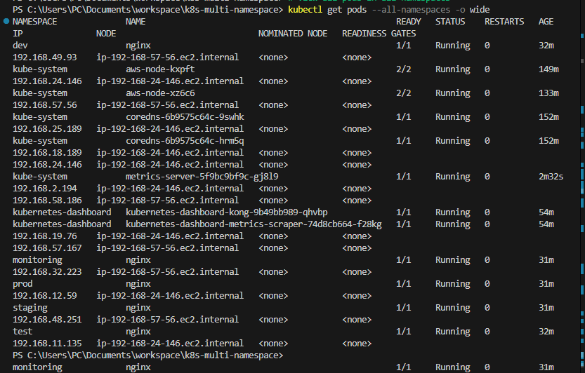
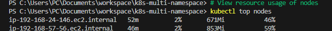


## Reflection and Learning
- From this project, I gained hands-on experience in setting up and managing a multi-namespace Kubernetes environment on AWS EKS. I learned how to:
- Deploy and manage an EKS cluster with multiple worker nodes, ensuring high availability and proper configuration.
- Install and configure the Kubernetes Dashboard using Helm, create service accounts, and set up role bindings for secure access.
- Organize resources using namespaces and deploy pods systematically, which reinforced my understanding of resource isolation and management in Kubernetes.
- Monitor cluster resources effectively using both the Dashboard and Metrics Server, which helped me understand CPU/memory metrics, pod status, and node health.
- Troubleshoot real-world issues, including port-forwarding, service accessibility, certificate warnings, and deployment errors, which improved my debugging and problem-solving skills in Kubernetes.

Overall, this project strengthened my practical Kubernetes skills, particularly in cluster setup, resource management, monitoring, and security configurations, preparing me for managing production-grade Kubernetes environments.


## Conclusion

This project demonstrated the complete lifecycle of setting up a multi-namespace Kubernetes environment on AWS EKS, deploying a monitoring dashboard, deploying workloads, and observing cluster metrics. The experience improved my proficiency in Kubernetes administration and cloud-native operations.


## Project Repository

You can find the complete source code for this project in the GitHub repository:
[https://github.com/BigOronaa/k8s-multi-namespace](https://github.com/BigOronaa/k8s-multi-namespace)