# Multi-Namespace Kubernetes Platform on AWS EKS

## Project Overview

This project demonstrates the deployment and management of a multi-namespace Kubernetes environment on AWS EKS. The implementation focused on cluster provisioning, namespace isolation, workload deployment, and observability using Kubernetes Dashboard and Metrics Server.

The environment was structured to simulate production-style workload separation across development, testing, staging, production, and monitoring environments.

---

## Architecture Summary

### Infrastructure Components

- AWS EKS Cluster
- 2 Managed Worker Nodes
- Kubernetes Dashboard
- Metrics Server
- 5 Kubernetes Namespaces
- NGINX Workloads per Namespace

### Namespaces Created

- `dev`
- `test`
- `staging`
- `prod`
- `monitoring`

---

# Project Objectives

The objectives of this project were to:

- Provision and configure an AWS EKS cluster
- Implement namespace-based environment isolation
- Deploy workloads across multiple namespaces
- Configure Kubernetes Dashboard for cluster visibility
- Enable cluster resource monitoring using Metrics Server
- Validate node and pod resource consumption
- Gain operational experience with Kubernetes administration

---

# Environment Setup

## Installed Tools

The following tools were configured locally before deployment:

- `eksctl`
- `kubectl`
- `awscli`
- `helm`

### Version Verification

```bash
eksctl version
kubectl version --client
aws --version
```

### Screenshot

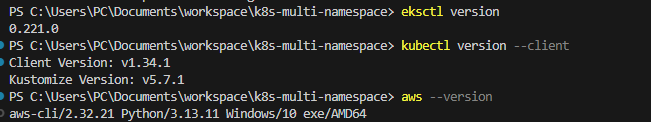

---

# AWS EKS Cluster Deployment

## Cluster Creation

The cluster was provisioned using `eksctl` in the `us-east-1` region.

### Initial Cluster Deployment

```bash
eksctl create cluster \
--name multi-namespace-cluster \
--region us-east-1 \
--nodegroup-name my-nodes \
--node-type t3.small \
--nodes 1 \
--managed
```

## Worker Node Scaling

The node group was later scaled to 2 worker nodes to improve workload distribution and simulate a production-ready environment.

```bash
eksctl scale nodegroup \
--cluster multi-namespace-cluster \
--region us-east-1 \
--name my-nodes \
--nodes 2 \
--nodes-max 3
```

### Screenshots

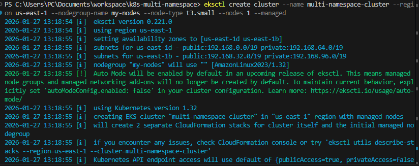

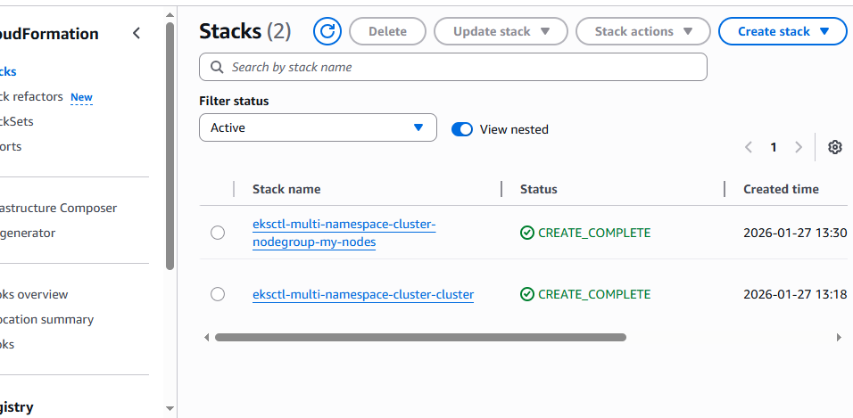

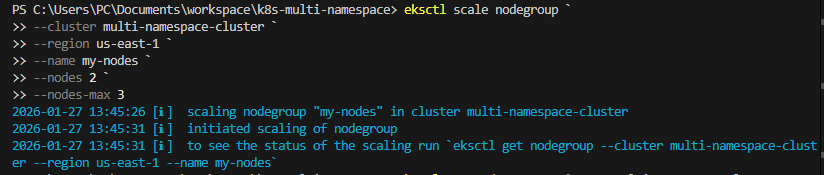

---

## Cluster Verification

The cluster and worker nodes were verified using `kubectl`.

```bash
kubectl get nodes
kubectl get svc
```

### Screenshot

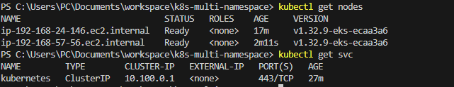

---

# Kubernetes Dashboard Deployment

## Dashboard Installation Using Helm

The Kubernetes Dashboard was deployed into a dedicated namespace using Helm.

```bash
helm upgrade --install kubernetes-dashboard \
kubernetes-dashboard/kubernetes-dashboard \
--namespace kubernetes-dashboard \
--create-namespace
```

### Screenshot

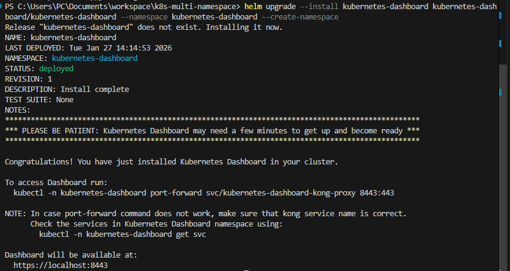

---

## Dashboard Pod Verification

```bash
kubectl get pods -n kubernetes-dashboard
```

### Screenshot

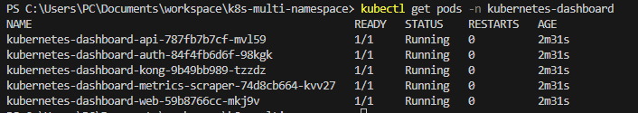

---

## Administrative Access Configuration

A `ServiceAccount` and `ClusterRoleBinding` with administrative privileges were created to enable secure access to cluster resources through the dashboard.

### Screenshot

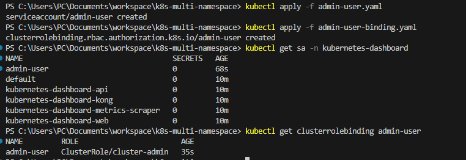

---

## Dashboard Access

Cluster access was exposed locally using:

```bash
kubectl proxy
```

Authentication tokens were generated and used to securely access the dashboard interface.

### Screenshot

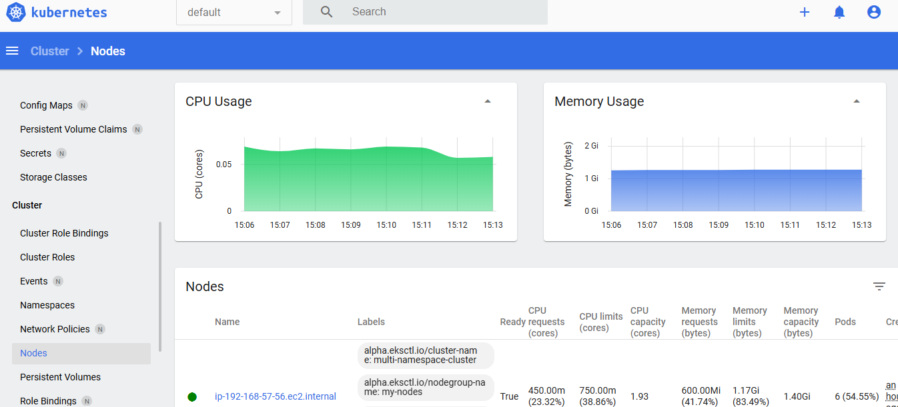

---

# Namespace Isolation and Workload Deployment

## Namespace Creation

Five namespaces were created to simulate environment isolation commonly used in production Kubernetes environments.

```bash
kubectl create namespace dev
kubectl create namespace test
kubectl create namespace staging
kubectl create namespace prod
kubectl create namespace monitoring
```

### Screenshot

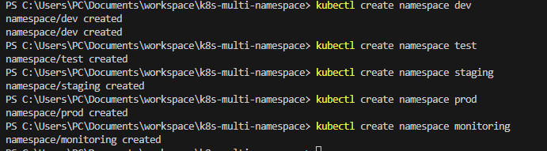

---

# NGINX Workload Deployment

## Pod Manifest

A reusable NGINX pod manifest was created and deployed into each namespace.

```yaml
apiVersion: v1
kind: Pod
metadata:
  name: nginx
spec:
  containers:
    - name: nginx
      image: nginx:latest
      ports:
        - containerPort: 80
```

---

## Pod Deployment

```bash
kubectl apply -f nginx-pod.yaml -n dev
kubectl apply -f nginx-pod.yaml -n test
kubectl apply -f nginx-pod.yaml -n staging
kubectl apply -f nginx-pod.yaml -n prod
kubectl apply -f nginx-pod.yaml -n monitoring
```

### Screenshot

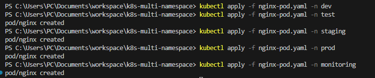

---

## Pod Verification

```bash
kubectl get pods -n dev
kubectl get pods -n test
kubectl get pods -n staging
kubectl get pods -n prod
kubectl get pods -n monitoring
```

---

# Resource Monitoring and Observability

## Metrics Server Integration

Metrics Server was configured to enable CPU and memory monitoring across nodes and pods.

This enabled:

- Pod resource visibility
- Node-level monitoring
- Kubernetes Dashboard metrics integration
- Resource usage analysis

---

## Namespace Monitoring

Each namespace was verified through the Kubernetes Dashboard to ensure workloads were running successfully.

### Screenshots

### Development Namespace

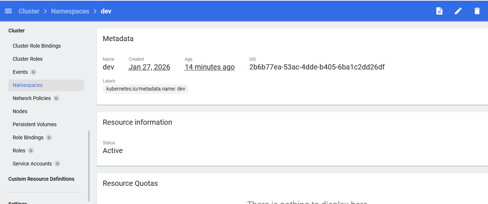

### Test Namespace

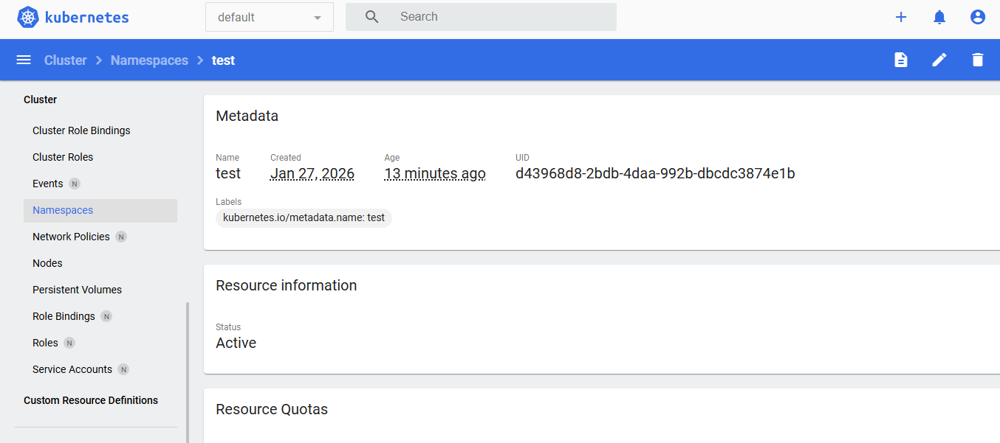

### Staging Namespace

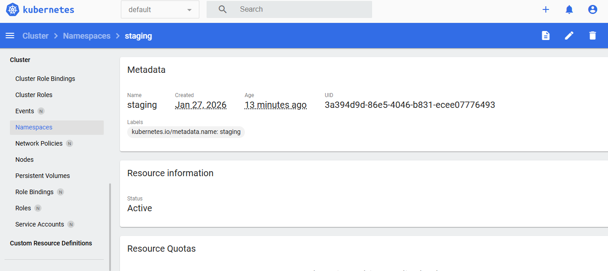

### Production Namespace

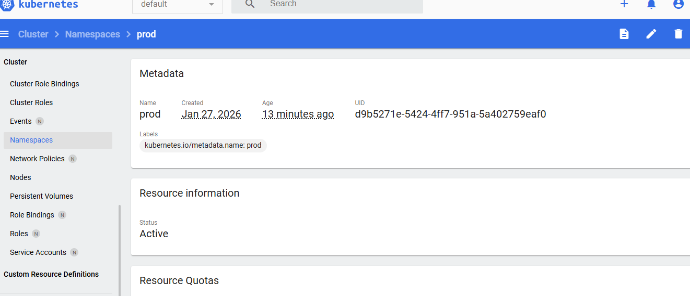

### Monitoring Namespace

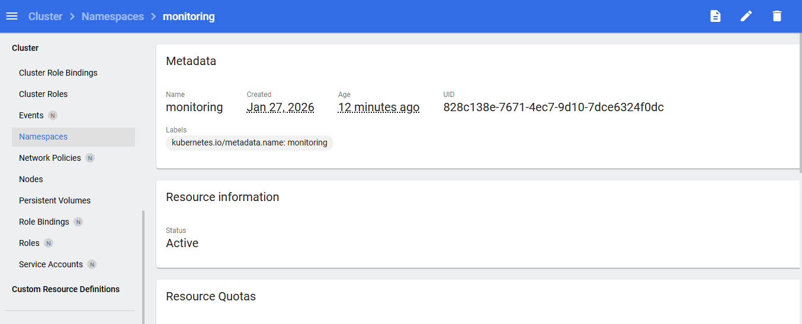

---

# Node Monitoring

The worker nodes were inspected to validate cluster health and workload scheduling.

Key checks included:

- Node readiness state
- CPU utilization
- Memory utilization
- Pod scheduling distribution

### Screenshots

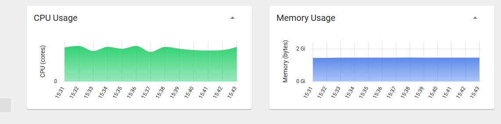

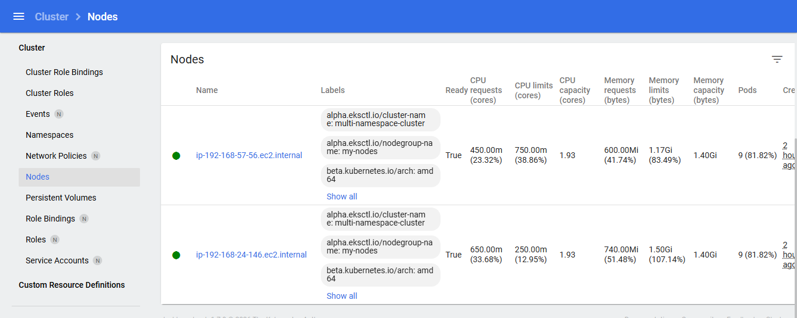

---

# Resource Usage Validation

## Cluster-Wide Pod Visibility

```bash
kubectl get pods --all-namespaces -o wide
```

## Node Resource Usage

```bash
kubectl top nodes
```

## Namespace Pod Metrics

```bash
kubectl top pods -n dev
kubectl top pods -n test
kubectl top pods -n staging
kubectl top pods -n prod
kubectl top pods -n monitoring
```

### Screenshots

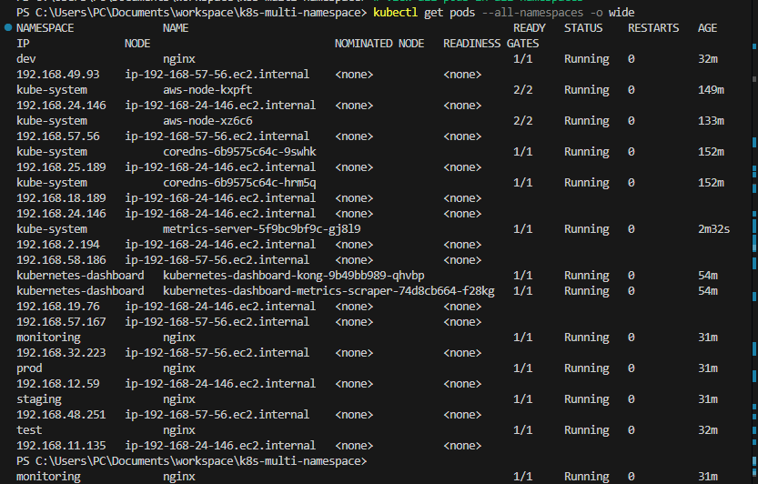

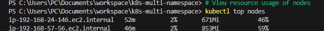

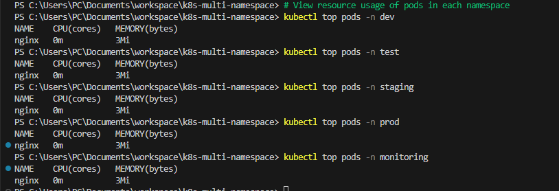

---

# Challenges and Troubleshooting

During implementation, several operational issues were encountered and resolved, including:

- Dashboard access configuration
- Kubernetes authentication token generation
- Service accessibility validation
- Metrics Server integration issues
- Namespace workload verification
- Cluster role and RBAC configuration
- Resource visibility troubleshooting

These troubleshooting exercises improved practical Kubernetes debugging and operational skills.

---

# Key Outcomes

This project successfully demonstrated:

- AWS EKS cluster provisioning and scaling
- Namespace-based workload isolation
- Kubernetes Dashboard deployment and administration
- Resource observability using Metrics Server
- Multi-environment workload management
- Kubernetes operational troubleshooting
- Cluster monitoring and validation

---

# Skills Demonstrated

- AWS EKS Administration
- Kubernetes Namespace Management
- Kubernetes Dashboard Configuration
- Helm Package Management
- Metrics Server Deployment
- Cluster Monitoring and Observability
- Linux CLI Operations
- Kubernetes RBAC
- Resource Monitoring
- Container Workload Management

---

# Conclusion

This project provided hands-on experience deploying and operating a multi-namespace Kubernetes platform on AWS EKS. It reinforced practical skills in cluster provisioning, namespace isolation, workload deployment, monitoring, and Kubernetes administration.

The implementation mirrors foundational production Kubernetes operations and demonstrates practical experience with cloud-native infrastructure management.
